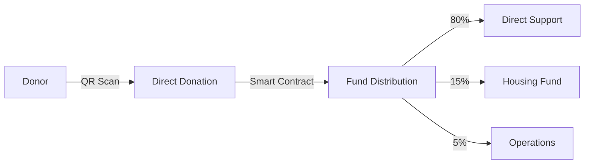

<div align="center">


[](https://open.spotify.com/show/3Q2RpnzF9sUv26yPMP9tWI)
[](https://www.arcanaconcept.com/concepts/sheltr)
[](https://sheltr-ops.replit.app)
[](https://www.linkedin.com/company/arcana-concept)
[](https://substack.com/home/post/p-153502903)

# 🏠 SHELTR
### *Hacking Homelessness Through Direct-Impact Technology*

**Revolutionizing Charitable Giving Through Technology**
*Project Initialization: December 2024 - Beta Launch (V1.0.0) Mid-January 2025*
*Version: 0.5.8*

</div>

## 🌟 Overview

SHELTR is revolutionizing charitable giving through cutting-edge technology integration. Our platform seamlessly combines **QR code donations**, **blockchain verification**, and **AI-driven insights** to create a transparent, efficient, and impactful giving ecosystem.

### 🎯 Core Features
- **Instant QR Donations**: Scan-and-give technology
- **Blockchain Verification**: 100% transparent tracking
- **Smart Fund Allocation**: 80/15/5 distribution model
- **AI-Powered Insights**: Data-driven impact optimization
- **Gamified Engagement**: Donor reward system



## 📊 Implementation Status

| Component | Status | Progress |
|-----------|---------|-----------|
| Core System | ✅ STABLE |  |
| Auth System | ✅ STABLE |  |
| QR System | ✅ STABLE |  |
| Blockchain | 🟡 IN PROGRESS |  |
| Analytics | 🟡 IN PROGRESS |  |
| AI Integration | 🔵 PLANNED |  |

## 🛠️ Technology Stack

- **QR Code Donations**: Simplified donation process using QR codes.
- **Blockchain Verification**: Secure and transparent transaction tracking.
- **AI-Driven Insights**: Personalized donor insights and recommendations.
- **Gamified Engagement**: Interactive donor experiences to boost participation.
- **Role-Based Access**: Tailored access for different user roles.
- **Real-Time Analytics**: Comprehensive data visualization and impact tracking.

```typescript
interface TechStack {
  frontend: {
    framework: 'React 18',
    language: 'TypeScript 5.0',
    state: 'Zustand',
    styling: 'Tailwind CSS'
  },
  backend: {
    database: 'Supabase',
    api: 'REST + WebSocket',
    blockchain: 'Polygon',
    analytics: 'Custom + Recharts'
  }
}
```

## 📈 Impact Metrics

| Metric | Target (2025) | Current |
|--------|---------------|---------|
| Active Users | 100,000 | 10 |
| Monthly Donations | $5M | $0M |
| Housing Fund | $10M | $0M |
| Success Rate | 75% | 0% |

## 🗺️ Roadmap

### Development Timeline
| Phase | Status | Timeline |
|-------|---------|----------|
| **Alpha** |
| Core Development | ✅ Done | 2024-10-01 to 2024-12-31 |
| QR System | ✅ Done | 2024-11-15 to 2024-12-31 |
| Auth System | ✅ Done | 2024-12-01 to 2024-12-31 |
| **Beta** |
| Smart Contracts | 🟡 Active | 2025-01-01 to 2025-01-31 |
| Blockchain Integration | 🟡 Active | 2025-01-15 to 2025-02-15 |
| Testing & Audits | ⏳ Planned | 2025-02-01 to 2025-02-28 |
| **Launch** |
| Public Beta | 🎯 Milestone | 2025-02-01 |
| V1 Release | 🎯 Milestone | 2025-03-31 |

## 🤝 Contributing + Documentation 📚

We welcome contributions! Here's how you get up to speed with the documentation:

## 📚 Documentation Index

### 🎯 About SHELTR
- [📋 Project Roadmap](/public/docs/about/roadmap.md)
- [📄 Technical Whitepaper](/public/docs/about/whitepaper_final.md)

### 🏗️ Core Architecture
- [🔌 API Documentation](/public/docs/core/api.md)
- [🏛️ System Architecture](/public/docs/core/architecture.md)
- [🔐 Security Framework](/public/docs/core/security.md)
- [👥 Role-Based Access Control](/public/docs/core/rbac.md)
- [⚙️ Technical Specifications](/public/docs/core/technical.md)

### 🛠️ Technical Implementation
- [🔑 Authentication System](/public/docs/technical/authentication.md)
- [🗄️ Database Architecture](/public/docs/technical/database.md)
- [📱 QR System Documentation](/public/docs/technical/qr-system.md)
- [🏗️ Build Tracking](/public/docs/technical/build_track.md)

### 📊 Analytics & Components
- [📈 Analytics Components](/public/docs/reference/analytics-components.md)
- [📦 Analytics Inventory](/public/docs/reference/analytics-inventory.md)
- [🧩 Component Library](/public/docs/reference/components.md)

### 🚀 Development Guides
- [✨ Best Practices](/public/docs/guides/best-practices.md)
- [🔨 Implementation Guide](/public/docs/guides/buildout_implementation.md)
- [🚀 Deployment Guide](/public/docs/guides/deployment.md)
- [🌳 Project Structure](/public/docs/dev/notes/tree/project-structure.md)

### 📋 Project Status
- [📊 Status Report](/public/docs/project/status_report.md)
- [📝 Changelog](/public/docs/project/changelog.md)

### Quick Links
| Category | Documentation |
|----------|---------------|
| Getting Started | [Whitepaper](/public/docs/about/whitepaper_final.md) • [Architecture](/public/docs/core/architecture.md) |
| Development | [Best Practices](/public/docs/guides/best-practices.md) • [Implementation](/public/docs/guides/buildout_implementation.md) |
| Technical | [API](/public/docs/core/api.md) • [Security](/public/docs/core/security.md) |
| Status | [Project Status](/public/docs/project/status_report.md) • [Changelog](/public/docs/project/changelog.md) |

## 🌟 Theory of Change

SHELTR's approach to "hacking homelessness" combines:

1. **Direct Impact**: Immediate assistance through QR donations
2. **Sustainable Growth**: Smart contract-governed housing fund
3. **Data-Driven**: AI-powered resource optimization
4. **Community Engagement**: Gamified donor participation

## 📊 Success Metrics

### Fund Allocation Model
| Category | Percentage |
|----------|------------|
| Direct Support | 80% |
| Housing Fund | 15% |
| Operations | 5% |

## 🔒 Security & Compliance

- 🛡️ **Blockchain Verification**: Every transaction
- 🔐 **Data Protection**: GDPR & CCPA compliant
- 📱 **Secure QR**: Dynamic & encrypted
- 🏦 **Smart Contracts**: Audited & verified

## 📬 Contact & Support

- 📧 Email the developer: joel@arcanaconcept.com
- 💬 BlueSky: [Join our community](https://sheltrops.bsky.social)
- 📱 App: [SHELTR](https://sheltr-ops.replit.appv)

---

<div align="center">

*"Innovation meets compassion at the intersection of technology and social change."*

[Website](https://arcanaconcept.com/concepts/sheltr) • [Documentation](https://github.com/mrj0nesmtl/sheltr-v2/tree/main/public/docs) • [Community](https://arcanaconcept.comv)

</div>
