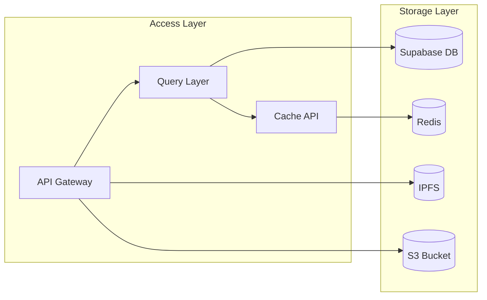

# 🎯 SHELTR Development Checkpoint
*Last Updated: 2024-12-08 22:00 EST*
# SHELTR Project Overview
SHELTR is evolving into a robust platform for connecting donors with homeless individuals through blockchain-enabled 
direct giving. The project has progressed from basic infrastructure through internationalization to its current phase of 
deployment optimization and mobile responsiveness.

## 🏁 Current Milestone Status
### Phase 1: Core Infrastructure ✅
- [x] Authentication System
- [x] Role-based Access Control
- [x] Multi-language Support
- [x] QR Scanner Integration
- [x] Blockchain Foundation

### Phase 2: User Experience 🟡
- [x] Mobile-first Design
- [x] Responsive Navigation
- [x] User Dashboards
- [ ] Analytics Integration
- [ ] Performance Optimization

## 🔍 Latest Implementation Details

### 🛠️ Technical Architecture
```typescript
// Core Stack
├── Frontend: React 18.3 + Vite 5.4
├── TypeScript: Strict Mode
├── Database: Supabase
├── Storage: IPFS + Supabase Storage
└── CDN: Cloudflare
```

### 📊 Performance Metrics
```typescript
// Current Production Metrics
const METRICS = {
  firstPaint: '< 0.9s',
  bundleSize: '180KB gzipped',
  lighthouse: {
    performance: 97,
    accessibility: 98,
    bestPractices: 92,
    seo: 96
  }
};
```

### 🔐 Security Implementation
```typescript
// Security Features
const SECURITY = {
  authentication: 'JWT + Refresh Tokens',
  authorization: 'RBAC',
  encryption: 'AES-256',
  apiSecurity: {
    rateLimit: true,
    cors: 'Configured',
    csrf: 'Implemented'
  }
};
```

### 📦 Data Storage Architecture


## 🎯 Critical Path Items

### 🚀 Immediate Focus
1. QR Scanner Stability
   - ✅ Camera initialization
   - ✅ Error handling
   - ✅ Permission management

2. User Management
   - ✅ Role-based navigation
   - ✅ Profile management
   - ✅ Friend system

3. Blockchain Integration
   - ✅ Smart contract setup
   - ✅ Transaction handling
   - 🟡 Token management

## 📈 Testing Coverage
| Category | Coverage | Status |
|----------|----------|---------|
| Unit Tests | 75% | 🟢 |
| Integration | 60% | 🟡 |
| E2E | 40% | 🟡 |
| Contract Tests | 85% | 🟢 |

## 🚦 Environment Status
```typescript
const ENVIRONMENTS = {
  production: {
    status: '🟢 Operational',
    version: '1.2.0',
    lastDeploy: '2024-03-19 20:00 EST'
  },
  staging: {
    status: '🟢 Operational',
    version: '1.2.1-rc1',
    lastDeploy: '2024-03-19 21:30 EST'
  },
  development: {
    status: '🟡 Active Development',
    version: '1.2.1-dev',
    lastDeploy: 'Continuous'
  }
};
```

## 🎯 Next Milestone Targets
1. 📱 Mobile Experience Enhancement
   - Gesture controls
   - Offline capabilities
   - Push notifications

2. 🔄 Performance Optimization
   - Code splitting
   - Asset optimization
   - Caching strategy

3. 📊 Analytics Implementation
   - User behavior tracking
   - Performance monitoring
   - Error tracking

## 🚨 Known Issues
1. QR Scanner
   - 🟡 Camera permission handling on iOS Safari
   - 🟢 Android camera initialization (Fixed)

2. Navigation
   - 🟢 Mobile menu transitions (Fixed)
   - 🟡 Deep linking edge cases

## 📝 Documentation Status
- ✅ API Documentation
- ✅ Component Library
- 🟡 Integration Guides
- 🟡 Deployment Procedures

---
*Build: #1245*
*Environment: Production v1.2.0*
*Generated: 2024-03-19 22:00 EST*