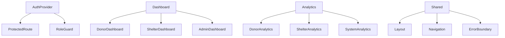

# 🚨 SHELTR Development Session - Part 2
*December 15, 2024 17:26 EST - Detailed Restructuring Plan*
*Version: 0.4.1*

## 🗺️ Detailed Restructuring Plan

### 1. Directory Structure Details
```bash
src/
  ├── auth/
  │   ├── components/
  │   │   ├── AuthProvider.tsx
  │   │   ├── ProtectedRoute.tsx
  │   │   └── RoleGuard.tsx
  │   ├── forms/
  │   │   ├── DonorSignUpForm/
  │   │   ├── ShelterSignUpForm/
  │   │   └── LoginForm/
  │   ├── hooks/
  │   │   ├── useAuth.ts
  │   │   └── useRoleAccess.ts
  │   ├── stores/
  │   │   └── authStore.ts
  │   └── types/
  │       ├── auth.types.ts
  │       └── schema.ts
  ├── dashboard/
  │   ├── donor/
  │   │   ├── components/
  │   │   ├── hooks/
  │   │   └── views/
  │   ├── shelter/
  │   │   ├── components/
  │   │   ├── hooks/
  │   │   └── views/
  │   └── admin/
  │       ├── components/
  │       ├── hooks/
  │       └── views/
  ├── analytics/
  │   ├── components/
  │   │   ├── charts/
  │   │   ├── metrics/
  │   │   └── tables/
  │   ├── hooks/
  │   │   ├── useAnalytics.ts
  │   │   └── useMetrics.ts
  │   └── stores/
  │       └── analyticsStore.ts
  └── shared/
      ├── components/
      ├── layouts/
      └── types/
```

## 🔄 Migration Guidelines

### 1. Component Migration Process
1. **Create New Location**
   ```bash
   mkdir -p src/new/component/path
   ```

2. **Move Component**
   ```bash
   git mv src/old/path/Component.tsx src/new/component/path/
   ```

3. **Update Imports**
   ```typescript
   // OLD
   import { Component } from '@/old/path/Component'
   
   // NEW
   import { Component } from '@/new/component/path/Component'
   ```

4. **Update Exports**
   ```typescript
   // Create index.ts in new location
   export * from './Component'
   ```

### 2. Migration Checklist
- [ ] Back up current implementation
- [ ] Create new directory structure
- [ ] Move components one at a time
- [ ] Update import statements
- [ ] Test functionality
- [ ] Update documentation
- [ ] Remove old directories

## 🔗 Component Relationship Diagram



## 📋 Expanded Implementation Plan

### Phase 1: Authentication Restructuring
1. **Form Components**
   ```typescript
   // src/auth/forms/DonorSignUpForm/index.tsx
   export const DonorSignUpForm = () => {
     // Implementation
   }
   ```

2. **Auth Hooks**
   ```typescript
   // src/auth/hooks/useAuth.ts
   export const useAuth = () => {
     // Implementation
   }
   ```

3. **Type Definitions**
   ```typescript
   // src/auth/types/auth.types.ts
   export interface AuthState {
     // Type definitions
   }
   ```

### Phase 2: Dashboard Integration
1. **Role-Based Views**
   ```typescript
   // src/dashboard/donor/views/DonorDashboard.tsx
   export const DonorDashboard = () => {
     // Implementation
   }
   ```

2. **Shared Components**
   ```typescript
   // src/shared/components/DashboardLayout/index.tsx
   export const DashboardLayout = () => {
     // Implementation
   }
   ```

### Phase 3: Analytics Implementation
1. **Analytics Components**
   ```typescript
   // src/analytics/components/charts/MetricsChart.tsx
   export const MetricsChart = () => {
     // Implementation
   }
   ```

2. **Analytics Hooks**
   ```typescript
   // src/analytics/hooks/useAnalytics.ts
   export const useAnalytics = () => {
     // Implementation
   }
   ```

## 🎯 Implementation Timeline

### Week 1: Authentication & Core
- Day 1-2: Auth component migration
- Day 3-4: Form implementation
- Day 5: Testing & fixes

### Week 2: Dashboard & Analytics
- Day 1-2: Dashboard restructuring
- Day 3-4: Analytics implementation
- Day 5: Integration testing

### Week 3: Optimization & Documentation
- Day 1-2: Performance optimization
- Day 3-4: Documentation updates
- Day 5: Final testing

## 🔍 Testing Strategy

### 1. Unit Tests
```typescript
// src/__tests__/auth/forms/DonorSignUpForm.test.tsx
describe('DonorSignUpForm', () => {
  // Test implementations
})
```

### 2. Integration Tests
```typescript
// src/__tests__/integration/auth.test.tsx
describe('Authentication Flow', () => {
  // Test implementations
})
```

### 3. E2E Tests
```typescript
// cypress/e2e/auth/signup.cy.ts
describe('Signup Flow', () => {
  // Test implementations
})
```

## 📈 Success Metrics

### 1. Code Quality
- TypeScript coverage > 95%
- Test coverage > 85%
- Zero circular dependencies
- Consistent naming conventions

### 2. Performance
- Bundle size reduction
- Improved load times
- Reduced component re-renders
- Optimized data fetching

---

*Reference: [Main Implementation Plan](docs/prompt.md)*
*Status: Ready for Implementation* 🟢 