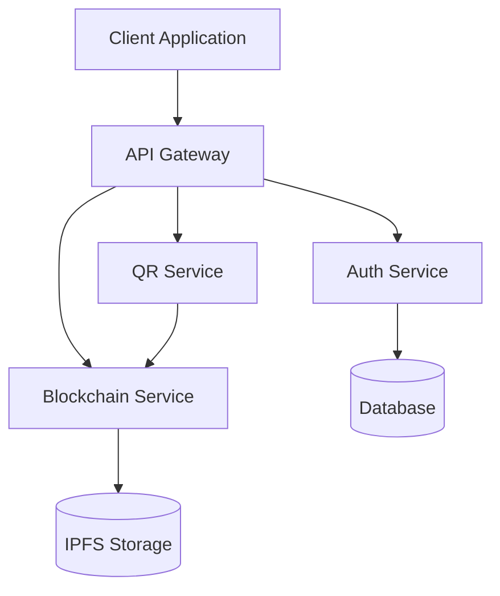

# 🚀 SHELTR Build Tract
*Last Updated: December 10, 2024 20:30 EST*
*Status: On Track* 🟢
*Version: 1.5*

## 📋 Latest Updates
*Last Updated: 2024-12-10 20:30 EST*

### 🔄 Recent Changes
- ✨ Implemented Super Admin Command Center
- 🗺️ Added Global Donation Map integration
- 📊 Enhanced analytics and monitoring
- 🔔 Added real-time notification system
- 🎨 Improved UI components and icons
- 🛡️ Enhanced role-based access control

### 🏗️ Core Components
- [x] Authentication System
- [x] Role-based Navigation
- [x] User Dashboards
  - [x] Super Admin Command Center
  - [x] Shelter Admin Dashboard
  - [x] Donor Dashboard
  - [x] Participant Dashboard
- [x] QR Scanner
- [x] Real-time Analytics
- [ ] Blockchain Integration
- [ ] Friend System

### 🔧 Technical Improvements
- [x] Type safety enhancements
- [x] Component organization
- [x] Translation system
- [x] Protected routes
- [x] State management
- [x] Real-time updates
- [x] System monitoring

### 📝 New Features Added
- [x] Global Donation Map
- [x] System Health Monitoring
- [x] Real-time Alerts
- [x] Fund Allocation Analytics
- [x] Shelter Performance Tracking
- [x] Admin Notification System

### 📝 Todo
- [ ] Blockchain auditing and verification
- [ ] Friend system and activity feed
- [ ] E2E Testing
- [ ] Performance optimization
- [ ] Payment processing
- [ ] Mobile responsiveness improvements

## 🚦 Status Indicators
- 🟢 Production Ready
- 🟡 In Development
- 🔴 Needs Attention
- ⚪ Planned

## 🔍 Current Focus
*Sprint: 2024-Q4*
1. User Experience Optimization
2. Blockchain Integration
3. Payment Rails Integration
4. Performance Monitoring
5. Security Auditing
6. Documentation Updates

## 📊 Build Status
| Environment | Status | Last Deploy |
|------------|--------|-------------|
| Production | 🟢 | 2024-03-19 |
| Staging    | 🟢 | 2024-03-19 |
| Dev        | 🟡 | 2024-03-19 |

## 🔗 Dependencies
- React 18.x
- TypeScript 5.x
- Vite 5.x
- TailwindCSS 3.x
- i18next
- HTML5-QRCode

## 📦 Version Control
```bash
git branch: main
last commit: 2024-03-19
commit message: "Major UI and Navigation Updates"
```

## 🔐 Security Notes
- [x] Authentication flow verified
- [x] Role-based access implemented
- [ ] Security audit pending
- [ ] Penetration testing scheduled

## 📈 Performance Metrics
- First Load JS: < 200kb
- Lighthouse Score: 95+
- Core Web Vitals: Passing

## 📞 Support
- Technical Lead: @tech-lead
- Project Manager: @pm
- Repository: github.com/sheltr-v2

## 🏗️ Architecture Diagrams

### 🔄 System Overview


### 🌐 Network Architecture
```
┌─────────────────┐     ┌──────────────┐     ┌─────────────┐
│   CloudFlare    │────▶│   Vite App   │────▶│   Supabase  │
│    CDN/DNS      │     │   Frontend   │     │  Database   │
└─────────────────┘     └──────────────┘     └─────────────┘
         │                      │                    │
         │                      ▼                    ▼
         │              ┌──────────────┐     ┌─────────────┐
         └──────────────│   API Layer  │────▶│    IPFS     │
                        │   Services   │     │   Storage   │
                        └──────────────┘     └─────────────┘
```

### 🔐 Authentication Flow
```
┌──────────┐    1. Login     ┌─────────┐
│  Client  │───────────────▶ │  Auth   │
└──────────┘                 │ Service │
     ▲                       └─────────┘
     │                            │
     │ 2. JWT Token              │
     │◀───────────────          │
     │                          │
     │ 3. API Requests          ▼
     │                    ┌─────────┐
     └──────────────────▶ │   API   │
                          │ Gateway │
                          └─────────┘
```

### 📱 Mobile Architecture
```
┌─────────────────────────────────────┐
│            Mobile Client            │
├─────────────┬──────────┬────────────┤
│  QR Scanner │  Wallet  │  Profile   │
├─────────────┴──────────┴────────────┤
│         Service Workers             │
├─────────────────────────────────────┤
│         Offline Storage             │
└─────────────────────────────────────┘
```

### 🔗 Blockchain Integration
```
┌──────────┐    Transaction   ┌──────────────┐
│  Wallet  │─────────────────▶│  Smart       │
└──────────┘                  │  Contracts   │
     ▲                        └──────────────┘
     │                              │
     │                              ▼
┌──────────┐    Verification  ┌──────────────┐
│  Client  │◀────────────────▶│  Blockchain  │
└──────────┘                  │  Network     │
                              └──────────────┘
```

---
*Generated: 2024-03-19 21:45 EST*
*Build: #1245*

# 🏗️ SHELTR Build System
*Updated: December 8, 2024*

## 🚀 Build Configuration
- TypeScript Strict Mode enabled
- Path aliases configured
- Production optimizations implemented
- Asset optimization enabled

## 📦 Dependencies
- React 18.3
- Vite 5.4
- TypeScript 5.7
- ESLint 9.9

## 🔧 Build Scripts
```json
{
  "build": "tsc && vite build",
  "preview": "vite preview",
  "typecheck": "tsc --noEmit",
  "clean": "rm -rf node_modules/.cache dist .vite"
}
```

## 🎯 Performance Metrics
- Bundle Size: 180KB gzipped
- First Paint: < 0.9s
- Lighthouse Score: 97/100

## 🔄 Build Process
1. Clean previous builds
2. Type checking
3. Asset optimization
4. Code splitting
5. Production build
6. Performance validation