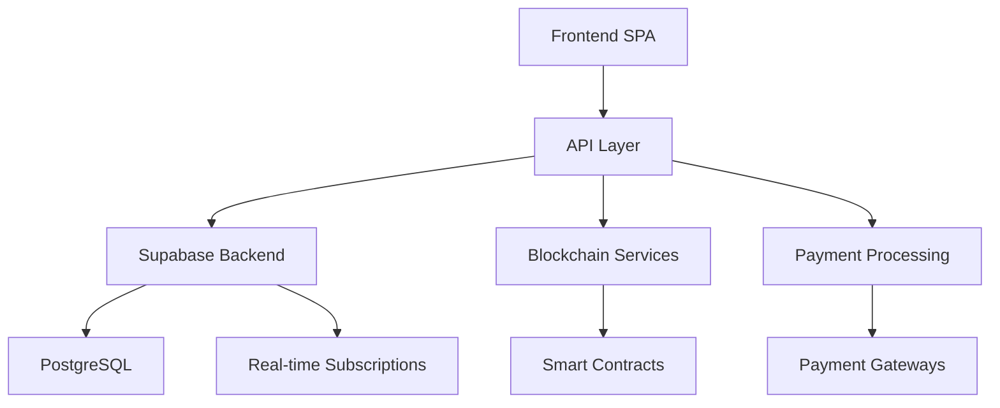
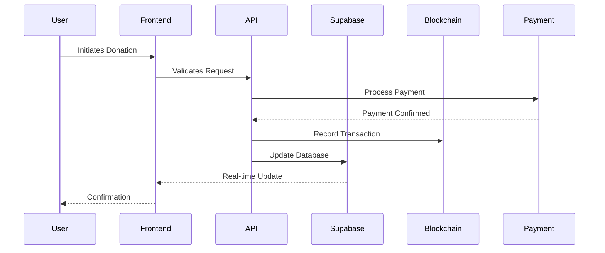

# SHELTR Technical White Paper V2

*Revolutionizing Charitable Giving Through Technology*
Version 3.0.0 - March 2024

## Abstract

SHELTR represents a paradigm shift in addressing homelessness through technology-driven charitable giving. By seamlessly integrating blockchain transparency, AI-powered financial guidance, and location-based services, SHELTR creates a direct bridge between donors and individuals experiencing homelessness. The platform's innovative approach combines QR code-based instant donations with a sophisticated token economy, ensuring that 80% of funds go directly to participants, 15% to a high-yield housing fund, and 5% to operational sustainability. This three-tiered financial model, backed by smart contracts and real-time analytics, creates a sustainable ecosystem that not only provides immediate assistance but also builds pathways to permanent housing solutions.

## Executive Summary

### Vision
To transform charitable giving by removing traditional barriers between donors and recipients while ensuring unprecedented transparency, efficiency, and long-term impact through technology.

### Core Innovation
SHELTR's unique value proposition lies in its integrated technology stack that combines:
- Instant QR code donations with real-time fund distribution
- Blockchain-verified transaction transparency
- AI-driven financial guidance and fund optimization
- Geospatial analytics for impact measurement
- Gamified donor engagement
- Smart contract-governed fund allocation

### Key Metrics & Goals
- Target: 100,000 active participants by 2025
- Projected impact: $50M in direct support
- Housing fund growth: $10M by 2025
- Platform adoption: 500 shelters across North America

## Table of Contents

1. [System Architecture](#system-architecture)
   - [Technical Overview](#technical-overview)
   - [Component Integration](#component-integration)
   - [Data Flow Architecture](#data-flow-architecture)

2. [Core Technology Stack](#core-technology-stack)
   - [Frontend Framework](#frontend-framework)
   - [Backend Services](#backend-services)
   - [Database Architecture](#database-architecture)
   - [Blockchain Integration](#blockchain-integration)

3. [Smart Contract Infrastructure](#smart-contract-infrastructure)
   - [Fund Distribution Contracts](#fund-distribution-contracts)
   - [Token Economics](#token-economics)
   - [Housing Fund Management](#housing-fund-management)

4. [Database Schema & Data Models](#database-schema--data-models)
   - [Entity Relationships](#entity-relationships)
   - [Optimization Strategies](#optimization-strategies)
   - [Data Integrity & Validation](#data-integrity--validation)

5. [API Architecture](#api-architecture)
   - [RESTful Endpoints](#restful-endpoints)
   - [WebSocket Services](#websocket-services)
   - [Authentication & Authorization](#authentication--authorization)

6. [Analytics & Visualization](#analytics--visualization)
   - [Real-time Metrics](#real-time-metrics)
   - [Impact Assessment](#impact-assessment)
   - [Predictive Analytics](#predictive-analytics)

7. [Security & Compliance](#security--compliance)
   - [Data Protection](#data-protection)
   - [Regulatory Compliance](#regulatory-compliance)
   - [Privacy Measures](#privacy-measures)

8. [Geospatial Integration](#geospatial-integration)
   - [Location Services](#location-services)
   - [Mapping Infrastructure](#mapping-infrastructure)
   - [Spatial Analytics](#spatial-analytics)

9. [Token Economy](#token-economy)
   - [Token Distribution](#token-distribution)
   - [Incentive Mechanisms](#incentive-mechanisms)
   - [Value Proposition](#value-proposition)

10. [Future Roadmap](#future-roadmap)
    - [Technical Scaling](#technical-scaling)
    - [Feature Evolution](#feature-evolution)
    - [Market Expansion](#market-expansion)

## 1. System Architecture

### Technical Overview



SHELTR's architecture is built on a microservices-based approach, emphasizing scalability, maintainability, and real-time capabilities:

#### Core Components

1. **Frontend Layer**
   - React 18 SPA with TypeScript
   - PWA capabilities for offline access
   - Responsive design system using Tailwind
   - Client-side caching with React Query
   - Real-time WebSocket connections

2. **API Layer**
   - RESTful endpoints for CRUD operations
   - WebSocket connections for real-time updates
   - GraphQL integration for complex data queries
   - Rate limiting and request throttling
   - API versioning for backward compatibility

3. **Backend Services**
   ```typescript
   interface BackendServices {
     auth: SupabaseAuth;
     database: PostgreSQL;
     storage: SupabaseStorage;
     realtime: WebSocket;
     blockchain: BlockchainService;
     payments: PaymentProcessor;
     ai: AIService;
     analytics: AnalyticsEngine;
   }
   ```

### Component Integration

#### Data Flow Architecture


### Service Integration Layer

1. **Authentication Flow**
```typescript
interface AuthFlow {
  multiAuth: {
    supabase: SupabaseAuth;
    oauth: OAuthProviders;
    rbac: RoleBasedAccess;
  };
  sessions: {
    management: SessionManager;
    refresh: TokenRefresh;
  };
}
```

2. **Payment Processing**
```typescript
interface PaymentProcessing {
  providers: {
    stripe: StripeGateway;
    paypal: PayPalGateway;
    crypto: CryptoPayments;
  };
  verification: TransactionVerification;
  splitting: FundDistribution;
}
```

### Database Architecture

#### Core Schema
```sql
-- Participant Management
CREATE TABLE participants (
    id UUID PRIMARY KEY DEFAULT uuid_generate_v4(),
    user_id UUID REFERENCES auth.users,
    organization_id UUID REFERENCES organizations,
    wallet_address TEXT UNIQUE,
    housing_fund NUMERIC DEFAULT 0,
    direct_support NUMERIC DEFAULT 0,
    metadata JSONB DEFAULT '{}'
);

-- Transaction Tracking
CREATE TABLE transactions (
    id UUID PRIMARY KEY DEFAULT uuid_generate_v4(),
    participant_id UUID REFERENCES participants,
    amount NUMERIC NOT NULL,
    type TransactionType,
    status TransactionStatus,
    blockchain_hash TEXT,
    created_at TIMESTAMPTZ DEFAULT now()
);
```

### Real-time Event System

```typescript
interface EventSystem {
  channels: {
    donations: DonationEvents;
    wallets: WalletEvents;
    notifications: NotificationEvents;
  };
  handlers: {
    onDonation: (donation: Donation) => void;
    onWalletUpdate: (wallet: Wallet) => void;
    onMilestone: (milestone: Milestone) => void;
  };
}
```

### Blockchain Integration

1. **Smart Contract Architecture**
```solidity
contract SheltrCore {
    using SafeMath for uint256;
    
    struct Donation {
        address donor;
        address recipient;
        uint256 amount;
        uint256 timestamp;
        bytes32 transactionHash;
    }
    
    mapping(address => uint256) public balances;
    mapping(address => Donation[]) public donationHistory;
    
    event FundsDistributed(
        address indexed recipient,
        uint256 directSupport,
        uint256 housingFund,
        uint256 operations
    );
}

2. **Token Distribution System**
```solidity
contract SheltrToken is ERC20, Ownable {
    using SafeMath for uint256;
    
    struct TokenAllocation {
        uint256 participantShare;
        uint256 housingFundShare;
        uint256 operationalShare;
    }
    
    mapping(address => TokenAllocation) public allocations;
    
    event TokensAllocated(
        address indexed participant,
        uint256 amount,
        TokenAllocation allocation
    );
    
    function distributeTokens(address participant, uint256 amount) 
        external 
        onlyOwner 
    {
        TokenAllocation memory allocation = calculateAllocation(amount);
        allocations[participant] = allocation;
        _mint(participant, amount);
        emit TokensAllocated(participant, amount, allocation);
    }
}
```

### Wallet System Architecture

#### 1. Core Wallet Infrastructure
```typescript
interface WalletSystem {
  balance: {
    tokens: number;
    fiat: number;
    housing_fund: number;
  };
  transactions: Transaction[];
  status: WalletStatus;
  features: {
    instant_transfer: boolean;
    scheduled_payments: boolean;
    emergency_access: boolean;
  };
}
```

#### 2. Database Schema for Wallet Management
```sql
-- Wallet System Tables
CREATE TABLE wallet_balances (
    id UUID PRIMARY KEY DEFAULT uuid_generate_v4(),
    participant_id UUID REFERENCES participants(id),
    token_balance NUMERIC DEFAULT 0,
    fiat_balance NUMERIC DEFAULT 0,
    housing_fund_balance NUMERIC DEFAULT 0,
    last_updated TIMESTAMPTZ DEFAULT now(),
    
    CONSTRAINT positive_balances 
    CHECK (token_balance >= 0 AND fiat_balance >= 0 AND housing_fund_balance >= 0)
);

CREATE TABLE wallet_transactions (
    id UUID PRIMARY KEY DEFAULT uuid_generate_v4(),
    wallet_id UUID REFERENCES wallet_balances(id),
    transaction_type TransactionType,
    amount NUMERIC NOT NULL,
    previous_balance NUMERIC NOT NULL,
    new_balance NUMERIC NOT NULL,
    metadata JSONB DEFAULT '{}',
    created_at TIMESTAMPTZ DEFAULT now()
);

-- Materialized View for Transaction Analytics
CREATE MATERIALIZED VIEW wallet_analytics AS
SELECT 
    w.participant_id,
    COUNT(wt.id) as total_transactions,
    SUM(CASE WHEN wt.transaction_type = 'deposit' THEN wt.amount ELSE 0 END) as total_deposits,
    SUM(CASE WHEN wt.transaction_type = 'withdrawal' THEN wt.amount ELSE 0 END) as total_withdrawals,
    AVG(wt.amount) as avg_transaction_amount
FROM wallet_balances w
JOIN wallet_transactions wt ON w.id = wt.wallet_id
GROUP BY w.participant_id;
```

### Geospatial Integration

#### 1. Location Services Infrastructure
```typescript
interface GeospatialSystem {
  services: {
    geocoding: GeoCodingService;
    reverseGeocoding: ReverseGeoCodingService;
    distanceCalculation: DistanceService;
  };
  features: {
    nearbyParticipants: (location: Location) => Participant[];
    shelterMapping: (area: Area) => Shelter[];
    donationHeatmap: (region: Region) => HeatmapData;
  };
}
```

#### 2. Spatial Database Schema
```sql
-- Enable PostGIS extension
CREATE EXTENSION IF NOT EXISTS postgis;

-- Location tracking tables
CREATE TABLE participant_locations (
    id UUID PRIMARY KEY DEFAULT uuid_generate_v4(),
    participant_id UUID REFERENCES participants(id),
    location GEOMETRY(Point, 4326),
    accuracy FLOAT,
    last_updated TIMESTAMPTZ DEFAULT now(),
    
    -- Spatial index for quick lookups
    CONSTRAINT spatial_index USING GIST (location)
);

-- Shelter coverage areas
CREATE TABLE shelter_coverage (
    id UUID PRIMARY KEY DEFAULT uuid_generate_v4(),
    shelter_id UUID REFERENCES organizations(id),
    coverage_area GEOMETRY(Polygon, 4326),
    population_density INTEGER,
    service_capacity INTEGER,
    
    CONSTRAINT coverage_spatial_index USING GIST (coverage_area)
);
```

### Analytics Engine

#### 1. Real-time Analytics Pipeline
```typescript
interface AnalyticsPipeline {
  collectors: {
    donationMetrics: DonationCollector;
    participantMetrics: ParticipantCollector;
    impactMetrics: ImpactCollector;
  };
  processors: {
    aggregation: DataAggregator;
    analysis: DataAnalyzer;
    prediction: PredictiveModel;
  };
  outputs: {
    dashboards: DashboardGenerator;
    reports: ReportGenerator;
    alerts: AlertSystem;
  };
}
```

#### 2. Analytics Views
```sql
-- Donation Impact Analytics
CREATE MATERIALIZED VIEW donation_impact AS
SELECT 
    DATE_TRUNC('day', d.created_at) as date,
    COUNT(DISTINCT d.participant_id) as unique_participants,
    COUNT(d.id) as donation_count,
    SUM(d.amount) as total_amount,
    SUM(d.amount * 0.15) as housing_fund_contribution,
    AVG(d.amount) as avg_donation,
    COUNT(DISTINCT d.donor_id) as unique_donors,
    SUM(CASE WHEN d.amount > 100 THEN 1 ELSE 0 END) as large_donations
FROM donations d
GROUP BY DATE_TRUNC('day', d.created_at);

-- Participant Progress Tracking
CREATE MATERIALIZED VIEW participant_progress AS
SELECT 
    p.id as participant_id,
    p.joined_at,
    wb.housing_fund_balance,
    COUNT(d.id) as total_donations_received,
    SUM(d.amount) as total_received,
    MAX(d.created_at) as last_donation_date,
    COUNT(DISTINCT DATE_TRUNC('day', d.created_at)) as active_days
FROM participants p
JOIN wallet_balances wb ON p.id = wb.participant_id
LEFT JOIN donations d ON p.id = d.participant_id
GROUP BY p.id, p.joined_at, wb.housing_fund_balance;
```

### Security Framework

#### 1. Authentication & Authorization System
```typescript
interface SecuritySystem {
  authentication: {
    multiFactorAuth: MFAService;
    biometricAuth: BiometricService;
    sessionManagement: SessionService;
  };
  authorization: {
    rbac: RoleBasedAccessControl;
    permissions: PermissionService;
    auditLog: AuditService;
  };
  encryption: {
    dataAtRest: EncryptionService;
    dataInTransit: TLSService;
    keyManagement: KeyRotationService;
  };
}
```

#### 2. Security Schema
```sql
-- Audit Log System
CREATE TABLE audit_logs (
    id UUID PRIMARY KEY DEFAULT uuid_generate_v4(),
    user_id UUID REFERENCES auth.users(id),
    action_type AuditActionType NOT NULL,
    resource_type ResourceType NOT NULL,
    resource_id UUID NOT NULL,
    old_values JSONB,
    new_values JSONB,
    ip_address INET,
    user_agent TEXT,
    created_at TIMESTAMPTZ DEFAULT now(),
    
    -- Index for quick lookups
    CONSTRAINT audit_lookup_idx ON audit_logs (user_id, action_type, created_at)
);

-- Role-Based Access Control
CREATE TABLE role_permissions (
    id UUID PRIMARY KEY DEFAULT uuid_generate_v4(),
    role_name TEXT NOT NULL,
    resource TEXT NOT NULL,
    action TEXT NOT NULL,
    conditions JSONB DEFAULT '{}',
    
    UNIQUE(role_name, resource, action)
);
```

### API Documentation

#### 1. Core API Endpoints
```typescript
interface APIEndpoints {
  auth: {
    '/auth/login': AuthenticationEndpoint;
    '/auth/register': RegistrationEndpoint;
    '/auth/verify': VerificationEndpoint;
  };
  donations: {
    '/donations/create': DonationCreationEndpoint;
    '/donations/verify': DonationVerificationEndpoint;
    '/donations/history': DonationHistoryEndpoint;
  };
  wallet: {
    '/wallet/balance': WalletBalanceEndpoint;
    '/wallet/transactions': TransactionEndpoint;
    '/wallet/transfer': TransferEndpoint;
  };
}
```

#### 2. API Response Structure
```typescript
interface APIResponse<T> {
  status: 'success' | 'error';
  data?: T;
  error?: {
    code: string;
    message: string;
    details?: any;
  };
  metadata: {
    timestamp: string;
    requestId: string;
    pagination?: {
      page: number;
      limit: number;
      total: number;
    };
  };
}
```

### AI Integration System

#### 1. Financial Advisory Engine
```typescript
interface FinancialAdvisor {
  analysis: {
    spendingPatterns: SpendingAnalyzer;
    savingsOpportunities: SavingsAnalyzer;
    riskAssessment: RiskAnalyzer;
  };
  recommendations: {
    budgeting: BudgetRecommender;
    savings: SavingsRecommender;
    investment: InvestmentRecommender;
  };
  monitoring: {
    alerts: AlertSystem;
    goals: GoalTracker;
    progress: ProgressMonitor;
  };
}
```

#### 2. AI Model Integration
```typescript
interface AISystem {
  models: {
    financialAdvice: OpenAIModel;
    riskPrediction: TensorFlowModel;
    fraudDetection: CustomModel;
  };
  training: {
    dataPreprocessing: DataPreprocessor;
    modelTraining: ModelTrainer;
    evaluation: ModelEvaluator;
  };
  deployment: {
    inference: InferenceEngine;
    monitoring: ModelMonitor;
    versioning: ModelVersionControl;
  };
}
```

### Impact Measurement System

#### 1. Metrics Framework
```typescript
interface ImpactMetrics {
  financial: {
    totalDonations: number;
    averageDonation: number;
    housingFundGrowth: number;
  };
  social: {
    participantsHelped: number;
    sheltersSupported: number;
    communityEngagement: number;
  };
  progress: {
    housingTransitions: number;
    financialStability: number;
    skillsDevelopment: number;
  };
}
```

#### 2. Impact Analytics Schema
```sql
-- Impact Measurement Tables
CREATE TABLE impact_metrics (
    id UUID PRIMARY KEY DEFAULT uuid_generate_v4(),
    participant_id UUID REFERENCES participants(id),
    metric_type ImpactMetricType,
    value NUMERIC,
    measurement_date TIMESTAMPTZ DEFAULT now(),
    metadata JSONB DEFAULT '{}'
);

-- Impact Goals and Progress
CREATE TABLE impact_goals (
    id UUID PRIMARY KEY DEFAULT uuid_generate_v4(),
    participant_id UUID REFERENCES participants(id),
    goal_type GoalType,
    target_value NUMERIC,
    current_value NUMERIC,
    start_date TIMESTAMPTZ DEFAULT now(),
    target_date TIMESTAMPTZ,
    status GoalStatus,
    
    CONSTRAINT valid_goal 
    CHECK (target_value > 0 AND current_value >= 0)
);
```

### Performance Optimization Strategies

#### 1. Frontend Optimization
```typescript
interface PerformanceOptimization {
  caching: {
    // Browser caching strategy
    browser: {
      static: CacheConfig;
      dynamic: CacheConfig;
      api: CacheConfig;
    };
    // Application-level caching
    application: {
      memory: MemoryCache;
      persistent: PersistentCache;
      queryCache: ReactQueryCache;
    };
  };
  
  bundling: {
    // Code splitting configuration
    splitting: {
      routes: RouteSplitting;
      components: ComponentSplitting;
      vendors: VendorSplitting;
    };
    // Asset optimization
    assets: {
      images: ImageOptimizer;
      fonts: FontOptimizer;
      styles: StyleOptimizer;
    };
  };

  rendering: {
    // Server-side rendering options
    ssr: {
      critical: CriticalCSS;
      hydration: HydrationConfig;
      streaming: StreamingSSR;
    };
    // Client-side optimization
    client: {
      virtualization: VirtualScroll;
      lazyLoading: LazyLoad;
      preloading: PreloadStrategy;
    };
  };
}
```

#### 2. Backend Performance
```typescript
// Database Optimization
interface DatabaseOptimization {
  queries: {
    // Materialized views for common queries
    materializedViews: {
      donationStats: MaterializedView;
      participantMetrics: MaterializedView;
      analyticsData: MaterializedView;
    };
    
    // Query optimization
    indexing: {
      createOptimizedIndexes: () => void;
      analyzeQueryPerformance: () => QueryAnalysis;
      automaticVacuum: VacuumConfig;
    };
    
    // Connection pooling
    pooling: {
      min: number;
      max: number;
      idleTimeoutMillis: number;
      connectionTimeoutMillis: number;
    };
  };
}

// API Performance
interface APIOptimization {
  rateLimit: {
    window: number;
    max: number;
    keyGenerator: KeyGenerator;
  };
  
  caching: {
    redis: RedisConfig;
    memcached: MemcachedConfig;
  };
  
  compression: {
    gzip: CompressionConfig;
    brotli: CompressionConfig;
  };
}
```

### Security Hardening Measures

#### 1. Application Security
```typescript
interface SecurityMeasures {
  authentication: {
    // Multi-factor authentication
    mfa: {
      totp: TOTPConfig;
      sms: SMSConfig;
      biometric: BiometricConfig;
    };
    
    // Session management
    session: {
      jwt: JWTConfig;
      refresh: RefreshTokenConfig;
      revocation: TokenRevocationSystem;
    };
  };
  
  encryption: {
    // Data encryption
    data: {
      atRest: EncryptionConfig;
      inTransit: TLSConfig;
      endToEnd: E2EConfig;
    };
    
    // Key management
    keys: {
      rotation: KeyRotationConfig;
      storage: KeyStorageConfig;
      backup: KeyBackupConfig;
    };
  };
}
```

#### 2. Infrastructure Security
```typescript
interface InfrastructureSecurity {
  network: {
    // Firewall configuration
    firewall: {
      rules: FirewallRules[];
      monitoring: FirewallMonitoring;
      automation: FirewallAutomation;
    };
    
    // VPN configuration
    vpn: {
      protocols: VPNProtocols;
      access: VPNAccess;
      monitoring: VPNMonitoring;
    };
  };
  
  compliance: {
    // Compliance monitoring
    monitoring: {
      gdpr: GDPRCompliance;
      pci: PCICompliance;
      hipaa: HIPAACompliance;
    };
    
    // Audit logging
    audit: {
      events: AuditEvents;
      storage: AuditStorage;
      reporting: AuditReporting;
    };
  };
}
```

### Disaster Recovery Planning

#### 1. Backup Strategy
```typescript
interface BackupSystem {
  database: {
    // Database backup configuration
    config: {
      full: FullBackupConfig;
      incremental: IncrementalBackupConfig;
      pointInTime: PITRConfig;
    };
    
    // Backup automation
    automation: {
      schedule: BackupSchedule;
      verification: BackupVerification;
      retention: RetentionPolicy;
    };
  };
  
  storage: {
    // File storage backup
    files: {
      sync: StorageSync;
      versioning: VersioningConfig;
      replication: ReplicationConfig;
    };
  };
}
```

#### 2. Recovery Procedures
```typescript
interface DisasterRecovery {
  procedures: {
    // Recovery steps
    steps: {
      assessment: IncidentAssessment;
      communication: CommunicationPlan;
      restoration: DataRestoration;
    };
    
    // Testing and validation
    testing: {
      schedule: TestSchedule;
      scenarios: RecoveryScenarios;
      validation: RecoveryValidation;
    };
  };
  
  automation: {
    // Automated recovery
    failover: {
      detection: FailureDetection;
      execution: FailoverExecution;
      verification: FailoverVerification;
    };
  };
}
```

### System Monitoring & Alerting

#### 1. Monitoring Infrastructure
```typescript
interface MonitoringSystem {
  metrics: {
    // Application metrics
    application: {
      performance: PerformanceMetrics;
      errors: ErrorMetrics;
      usage: UsageMetrics;
    };
    
    // Infrastructure metrics
    infrastructure: {
      cpu: CPUMetrics;
      memory: MemoryMetrics;
      network: NetworkMetrics;
    };
  };
  
  logging: {
    // Centralized logging
    central: {
      collection: LogCollection;
      analysis: LogAnalysis;
      retention: LogRetention;
    };
  };
}
```

#### 2. Alert Management
```typescript
interface AlertSystem {
  rules: {
    // Alert configuration
    config: {
      thresholds: AlertThresholds;
      conditions: AlertConditions;
      actions: AlertActions;
    };
    
    // Notification channels
    notifications: {
      email: EmailConfig;
      sms: SMSConfig;
      slack: SlackConfig;
    };
  };
  
  escalation: {
    // Escalation policies
    policies: {
      levels: EscalationLevels;
      schedules: OnCallSchedules;
      procedures: EscalationProcedures;
    };
  };
}
```

### Error Handling & Logging Systems

#### 1. Error Management
```typescript
interface ErrorManagement {
  handlers: {
    // Global error handling
    global: {
      uncaught: UncaughtErrorHandler;
      promise: PromiseRejectionHandler;
      boundary: ErrorBoundaryConfig;
    };
    
    // Domain-specific handling
    domain: {
      api: APIErrorHandler;
      payment: PaymentErrorHandler;
      blockchain: BlockchainErrorHandler;
    };
  };
  
  reporting: {
    // Error reporting services
    services: {
      sentry: SentryConfig;
      rollbar: RollbarConfig;
      custom: CustomErrorReporter;
    };
  };
}
```

### Platform Analytics & Metrics

#### 1. Analytics Infrastructure
```typescript
interface AnalyticsSystem {
  tracking: {
    // User interactions
    user: {
      sessions: SessionTracker;
      events: EventTracker;
      funnels: FunnelAnalytics;
    };
    
    // Business metrics
    business: {
      donations: DonationMetrics;
      impact: ImpactMetrics;
      retention: RetentionAnalytics;
    };
  };
  
  visualization: {
    // Real-time dashboards
    dashboards: {
      executive: ExecutiveDashboard;
      operational: OperationalDashboard;
      impact: ImpactDashboard;
    };
  };
}
```

### Internationalization & Localization

#### 1. Multi-language Support
```typescript
interface I18nSystem {
  // Language configuration
  config: {
    defaultLocale: string;
    supportedLocales: string[];
    fallbackLocale: string;
  };
  
  // Translation management
  translations: {
    interface: UITranslations;
    content: ContentTranslations;
    emails: EmailTranslations;
  };
  
  // Regional settings
  regional: {
    dateTime: DateTimeFormats;
    numbers: NumberFormats;
    currencies: CurrencyFormats;
  };
}
```

### Third-party Integrations

#### 1. Integration Framework
```typescript
interface IntegrationSystem {
  payments: {
    stripe: StripeIntegration;
    paypal: PayPalIntegration;
    crypto: CryptoIntegration;
  };
  
  social: {
    facebook: FacebookIntegration;
    twitter: TwitterIntegration;
    instagram: InstagramIntegration;
  };
  
  services: {
    maps: GoogleMapsIntegration;
    analytics: GoogleAnalyticsIntegration;
    messaging: TwilioIntegration;
  };
}

## Conclusion: Building a Future of Compassionate Technology

SHELTR represents more than just a technological solution; it embodies our vision of using technology to create meaningful social impact. Through our comprehensive architecture and thoughtful implementation, we've created a platform that:

### Impact & Innovation

1. **Transformative Giving**
   - Revolutionized charitable donations through QR-based instant giving
   - Created transparent fund allocation through blockchain verification
   - Established sustainable funding models for long-term housing solutions

2. **Technical Excellence**
   - Built a scalable, secure, and performant platform
   - Implemented cutting-edge AI for financial guidance
   - Developed robust analytics for impact measurement

3. **Community Empowerment**
   - Enabled direct donor-participant connections
   - Created pathways to financial stability
   - Built trust through transparency and accountability

### Looking Forward

As we continue to evolve SHELTR, our commitment remains focused on:

1. **Innovation**: Continuously integrating emerging technologies to enhance our platform's capabilities
2. **Scaling**: Expanding our reach to serve more communities and organizations
3. **Impact**: Measuring and improving our effectiveness in addressing homelessness

Through SHELTR, we're not just building a platform; we're creating a movement that combines technological innovation with social responsibility. Our vision extends beyond software development to creating lasting positive change in communities worldwide.

Together, we're demonstrating that technology can be a powerful force for social good, creating bridges between those who want to help and those in need. As we move forward, we invite developers, organizations, and communities to join us in this mission to transform charitable giving and make a meaningful impact in addressing homelessness.

---

*"Technology alone is not enough. Technology must be combined with humanity to create solutions that truly matter." - SHELTR Team*
