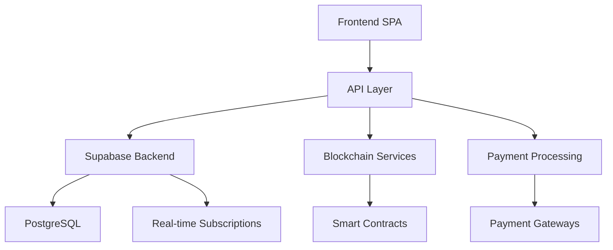
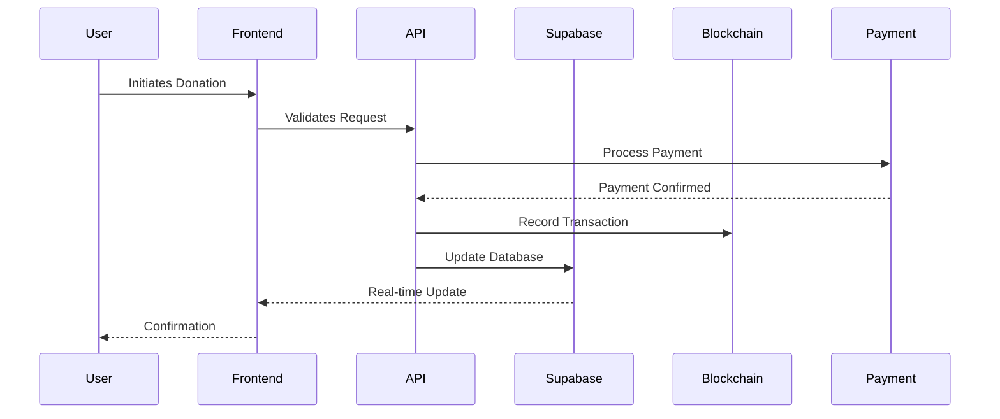

# SHELTR Technical White Paper
*Revolutionizing Charitable Giving Through Technology*
Version 3.0.0 - March 2024

## Abstract

SHELTR represents a paradigm shift in addressing homelessness through technology-driven charitable giving. By seamlessly integrating blockchain transparency, AI-powered financial guidance, and location-based services, SHELTR creates a direct bridge between donors and individuals experiencing homelessness. The platform's innovative approach combines QR code-based instant donations with a sophisticated token economy, ensuring that 80% of funds go directly to participants, 15% to a high-yield housing fund, and 5% to operational sustainability. This three-tiered financial model, backed by smart contracts and real-time analytics, creates a sustainable ecosystem that not only provides immediate assistance but also builds pathways to permanent housing solutions.

## Executive Summary

### Vision
To transform charitable giving by removing traditional barriers between donors and recipients while ensuring unprecedented transparency, efficiency, and long-term impact through technology. Built under the Arcana Concept model, SHELTR operates as a SaaS platform available as a white-label solution, making it adaptable for shelters, NGOs, and social organizations globally.

### Core Innovation
SHELTR's unique value proposition lies in its integrated technology stack that combines:
- Instant QR code donations with real-time fund distribution
- Blockchain-verified transaction transparency
- AI-driven financial guidance and fund optimization
- Geospatial analytics for impact measurement
- Gamified donor engagement
- Smart contract-governed fund allocation

### Key Metrics & Goals
- Target: 100,000 active participants by 2025
- Projected impact: $50M in direct support
- Housing fund growth: $10M by 2025
- Platform adoption: 500 shelters across North America

## Table of Contents

1. [System Architecture](#system-architecture)
   - [Technical Overview](#technical-overview)
   - [Component Integration](#component-integration)
   - [Data Flow Architecture](#data-flow-architecture)

2. [Core Features](#core-features)
   - [QR Scan and Give](#qr-scan-and-give)
   - [Blockchain Transparency](#blockchain-transparency)
   - [Multi-Auth User Roles](#multi-auth-user-roles)
   - [Homeless Depot Integration](#homeless-depot-integration)
   - [Financial Empowerment Tools](#financial-empowerment-tools)
   - [Analytics & Impact Tracking](#analytics-and-impact-tracking)
   - [Social Integration & Gamification](#social-integration-and-gamification)

3. [Technology Stack](#technology-stack)
   - [Frontend Framework](#frontend-framework)
   - [Backend Services](#backend-services)
   - [Database Architecture](#database-architecture)
   - [Blockchain Integration](#blockchain-integration)

4. [Smart Contract Infrastructure](#smart-contract-infrastructure)
   - [Fund Distribution Contracts](#fund-distribution-contracts)
   - [Token Economics](#token-economics)
   - [Housing Fund Management](#housing-fund-management)

5. [Security & Compliance](#security-and-compliance)
   - [Data Protection](#data-protection)
   - [Regulatory Compliance](#regulatory-compliance)
   - [Privacy Measures](#privacy-measures)

6. [Analytics & Visualization](#analytics-and-visualization)
   - [Real-time Metrics](#real-time-metrics)
   - [Impact Assessment](#impact-assessment)
   - [Predictive Analytics](#predictive-analytics)

7. [Deployment & Scaling](#deployment-and-scaling)
   - [Infrastructure](#infrastructure)
   - [Performance Optimization](#performance-optimization)
   - [Monitoring & Alerting](#monitoring-and-alerting)

8. [Future Roadmap](#future-roadmap)
   - [Technical Scaling](#technical-scaling)
   - [Feature Evolution](#feature-evolution)
   - [Market Expansion](#market-expansion)

9. [Additional Resources](#additional-resources)
   - [API Documentation](https://api.sheltr.dev)
   - [Developer Guide](https://docs.sheltr.dev)
   - [Integration Tutorials](https://learn.sheltr.dev)
   - [Community Forum](https://community.sheltr.dev)


## 1. System Architecture

### Technical Overview

SHELTR's architecture is built on a modern, microservices-based approach that prioritizes scalability, real-time capabilities, and security. Our system is designed to handle millions of transactions while maintaining sub-second response times and ensuring data integrity.



#### Core Components

1. **Frontend Layer**
```typescript
interface FrontendArchitecture {
  core: {
    react: React18Framework;
    typescript: TypeScriptConfig;
    vite: ViteBuildSystem;
  };
  features: {
    pwa: PWACapabilities;
    offline: OfflineFirst;
    realtime: WebSocketConnection;
  };
  optimization: {
    caching: ReactQueryCache;
    splitting: CodeSplitting;
    prefetching: DataPrefetch;
  };
}
```

2. **API Layer**
```typescript
interface APIArchitecture {
  endpoints: {
    rest: RESTfulAPI;
    graphql: GraphQLAPI;
    websocket: WebSocketServer;
  };
  middleware: {
    auth: AuthenticationMiddleware;
    validation: RequestValidation;
    rateLimit: RateLimiting;
  };
  integration: {
    payment: PaymentGateways;
    blockchain: BlockchainServices;
    analytics: AnalyticsEngine;
  };
}
```

### Data Flow Architecture

The following sequence diagram illustrates our optimized donation flow:



## Core Features

### 1. QR Scan and Give

The QR Code Donation System represents SHELTR's innovative approach to instant charitable giving. Each participant receives a unique, blockchain-verified QR code that serves as their digital identity within the platform.

```typescript
interface QRSystem {
  generation: {
    // QR Code Generation Service
    service: HTML5QRCode;
    options: {
      errorCorrectionLevel: 'H';
      margin: 4;
      scale: 8;
      width: 256;
      height: 256;
    };
  };
  
  verification: {
    // Real-time verification
    blockchain: BlockchainVerification;
    fraud: FraudDetection;
    status: QRStatusCheck;
  };

  tracking: {
    analytics: QRAnalytics;
    usage: QRUsageMetrics;
    performance: QRPerformanceStats;
  };
}
```

#### Implementation Details
- **Dynamic QR Generation**: Uses `HTML5-QRCode` with enhanced security features
- **Multi-Payment Support**: Integrated with:
  - Traditional: Stripe, PayPal, Apple Pay
  - Crypto: Ethereum, Bitcoin, Stablecoins
- **Real-time Verification**: Sub-second transaction confirmation

### 2. Blockchain Transparency & Public Ledger

Our hybrid blockchain approach combines traditional payment systems with blockchain verification, ensuring both compliance and transparency.

```solidity
contract SheltrTransparency {
    using SafeMath for uint256;
    
    struct DonationRecord {
        address donor;
        address participant;
        uint256 amount;
        uint256 timestamp;
        bytes32 paymentReference;
    }
    
    // Fund allocation constants
    uint256 public constant DIRECT_SUPPORT = 80;
    uint256 public constant HOUSING_FUND = 15;
    uint256 public constant OPERATIONS = 5;
    
    mapping(bytes32 => DonationRecord) public donations;
    
    event FundsAllocated(
        bytes32 indexed donationId,
        uint256 directSupport,
        uint256 housingFund,
        uint256 operations
    );
}
```

#### Key Components
- **Transaction Verification**: Each donation receives a unique blockchain hash
- **Smart Contract Distribution**:
  - 80% Direct Support
  - 15% Housing Fund
  - 5% Operational Sustainability
- **Public Audit Trail**: All transactions viewable on public blockchain

### 3. Multi-Auth User Roles

SHELTR implements a sophisticated role-based access control system using Supabase:

```typescript
interface AuthSystem {
  roles: {
    SHELTER_ADMIN: {
      permissions: string[];
      access_level: number;
      capabilities: string[];
    };
    DONOR: {
      permissions: string[];
      access_level: number;
      capabilities: string[];
    };
    PARTICIPANT: {
      permissions: string[];
      access_level: number;
      capabilities: string[];
    };
  };
  
  authentication: {
    supabase: SupabaseAuth;
    mfa: MultiFactorAuth;
    biometric: BiometricAuth;
  };
}
```

### 4. Homeless Depot: Shopify Integration

The Homeless Depot represents our innovative approach to participant empowerment through branded materials and resources.

```typescript
interface HomelessDepot {
  shopify: {
    // Store configuration
    store: {
      api: ShopifyAPI;
      theme: CustomTheme;
      checkout: CustomCheckout;
    };
    
    // Product management
    products: {
      qrMaterials: QRProductCatalog;
      brandedItems: BrandedCatalog;
      digitalAssets: DigitalProducts;
    };
    
    // Participant access
    access: {
      tokens: TokenWallet;
      rewards: RewardSystem;
      analytics: PurchaseAnalytics;
    };
  };
}

// Implementation Example
const participantStore = new HomelessDepot({
  tokenBalance: participant.tokens,
  availableProducts: filterByRegion(participant.location),
  rewardTier: calculateTier(participant.engagement)
});
```

### 5. Health, Wellness and Financial Empowerment Tools

Our AI-powered financial guidance system combines machine learning with personalized coaching:

```typescript
interface EmpowermentSystem {
  financial: {
    // AI-powered financial guidance
    ai: {
      budgeting: BudgetingAI;
      forecasting: ForecastingModel;
      recommendations: RecommendationEngine;
    };
    
    // Housing fund management
    housingFund: {
      investment: ETFManagement;
      growth: GrowthTracking;
      goals: GoalSetting;
    };
    
    // Health and wellness
    wellness: {
      mentalHealth: MentalHealthResources;
      physicalHealth: HealthTracking;
      nutrition: NutritionGuidance;
    };
  };
  
  coaching: {
    // Personalized guidance
    personal: {
      sessions: CoachingSessions;
      progress: ProgressTracking;
      milestones: MilestoneSystem;
    };
  };
}
```

### 6. Analytics & Impact Tracking

Comprehensive analytics system providing real-time insights and impact measurement:

```typescript
interface AnalyticsSystem {
  metrics: {
    // Donation metrics
    donations: {
      volume: DonationVolume;
      frequency: DonationFrequency;
      retention: DonorRetention;
    };
    
    // Impact metrics
    impact: {
      housingProgress: HousingMetrics;
      communityEngagement: EngagementMetrics;
      participantProgress: ProgressMetrics;
    };
    
    // Visualization
    visualization: {
      dashboards: CustomDashboards;
      reports: AutomatedReports;
      alerts: MetricAlerts;
    };
  };
}

// Real-time dashboard implementation
const ImpactDashboard = () => {
  const metrics = useMetrics();
  
  return (
    <DashboardContainer>
      <DonationMetrics data={metrics.donations} />
      <HousingProgress data={metrics.housing} />
      <CommunityImpact data={metrics.community} />
    </DashboardContainer>
  );
};
```

### 7. Social Media Integration & Gamification

Engaging social features and gamification mechanics to drive platform engagement:

```typescript
interface SocialSystem {
  sharing: {
    // Social media integration
    platforms: {
      facebook: FacebookSDK;
      twitter: TwitterAPI;
      instagram: InstagramAPI;
      tiktok: TikTokSDK;
    };
    
    // Content management
    content: {
      templates: SharingTemplates;
      scheduling: ContentScheduler;
      analytics: SocialAnalytics;
    };
  };
  
  gamification: {
    // Achievement system
    achievements: {
      badges: BadgeSystem;
      levels: LevelProgression;
      rewards: RewardDistribution;
    };
    
    // Community features
    community: {
      challenges: CommunityChallenges;
      leaderboards: LeaderboardSystem;
      events: CommunityEvents;
    };
  };
}
```

### 8. Privacy & Compliance

Robust security and compliance framework ensuring data protection and regulatory adherence:

```typescript
interface SecuritySystem {
  encryption: {
    // Data protection
    data: {
      atRest: AES256Encryption;
      inTransit: TLS13Security;
      backup: EncryptedBackups;
    };
    
    // Compliance
    compliance: {
      gdpr: GDPRCompliance;
      ccpa: CCPACompliance;
      hipaa: HIPAACompliance;
    };
  };
  
  privacy: {
    // Privacy controls
    controls: {
      consent: ConsentManagement;
      preferences: PrivacyPreferences;
      deletion: DataDeletion;
    };
    
    // Access control
    access: {
      rls: RowLevelSecurity;
      rbac: RoleBasedAccess;
      audit: AccessAudit;
    };
  };
}

// Implementation of privacy-first data handling
const handleSensitiveData = async (data: SensitiveData) => {
  const encrypted = await encryption.encrypt(data);
  const accessControl = new AccessControl(encrypted);
  await auditLog.record(accessControl.access);
  return accessControl;
};
```

Each of these core features is designed to work seamlessly together, creating a comprehensive platform that addresses both immediate needs and long-term solutions for homelessness. The integration of advanced technology with human-centered design ensures that SHELTR remains accessible while delivering powerful functionality.

## Technology Stack

### 1. Frontend Architecture

Our frontend architecture is built for performance, scalability, and developer experience:

```typescript
interface FrontendStack {
  core: {
    // Primary framework
    framework: {
      react: React18;
      typescript: TypeScript4;
      vite: ViteBuildTool;
    };
    
    // Styling and UI
    ui: {
      tailwind: TailwindCSS;
      headlessUI: HeadlessComponents;
      framerMotion: AnimationSystem;
    };
    
    // State management
    state: {
      zustand: GlobalState;
      reactQuery: DataFetching;
      contextAPI: LocalState;
    };
  };

  optimization: {
    // Performance optimizations
    performance: {
      codeSpitting: DynamicImports;
      lazyLoading: LazyComponents;
      imageOptimization: NextGenImages;
    };
  };
}

// Example implementation
const AppCore = () => {
  const { store, queries, optimizations } = useCoreSystem();
  
  return (
    <OptimizedProvider {...optimizations}>
      <QueryProvider {...queries}>
        <StateProvider {...store}>
          <App />
        </StateProvider>
      </QueryProvider>
    </OptimizedProvider>
  );
};
```

### 2. Backend Services

Comprehensive backend infrastructure leveraging modern cloud services:

```typescript
interface BackendStack {
  database: {
    // Primary database
    supabase: {
      postgres: PostgreSQL14;
      realtime: RealtimeSubscriptions;
      storage: BucketStorage;
    };
    
    // Caching layer
    cache: {
      redis: RedisCache;
      memcached: MemcachedLayer;
    };
  };
  
  services: {
    // Core services
    auth: SupabaseAuth;
    storage: CloudStorage;
    functions: EdgeFunctions;
    analytics: AnalyticsEngine;
  };
}
```

### 3. Blockchain Integration

```solidity
// Smart contract architecture
contract SheltrCore {
    using SafeMath for uint256;
    
    struct BlockchainServices {
        address payable treasury;
        address payable housingFund;
        address payable operations;
    }
    
    // Integration with traditional payment systems
    interface PaymentGateway {
        function processPayment(
            address donor,
            address recipient,
            uint256 amount
        ) external returns (bool);
    }
}
```

## Deployment & Scalability

### 1. Infrastructure as Code

```typescript
interface DeploymentInfrastructure {
  ci_cd: {
    // Continuous Integration
    github: {
      actions: WorkflowAutomation;
      secrets: SecretManagement;
      environments: EnvironmentConfig;
    };
    
    // Deployment platforms
    platforms: {
      vercel: VercelDeployment;
      netlify: NetlifyConfig;
      cloudflare: CloudflareWorkers;
    };
  };
  
  monitoring: {
    // System monitoring
    observability: {
      metrics: PrometheusMetrics;
      logging: DatadogLogging;
      tracing: OpenTelemetry;
    };
  };
}
```

### 2. Scaling Strategy

```typescript
interface ScalingStrategy {
  horizontal: {
    // Load balancing
    loadBalancer: {
      distribution: LoadDistribution;
      healthChecks: HealthMonitoring;
      failover: FailoverSystem;
    };
    
    // Auto-scaling
    autoscaling: {
      rules: ScalingRules;
      triggers: ScalingTriggers;
      limits: ResourceLimits;
    };
  };
  
  vertical: {
    // Resource optimization
    resources: {
      computation: ComputeResources;
      memory: MemoryAllocation;
      storage: StorageScaling;
    };
  };
}
```

## Future Roadmap

### 1. Technical Evolution (2024-2025)

```typescript
interface TechnicalRoadmap {
  ai: {
    // Enhanced AI capabilities
    features: {
      predictiveAnalytics: PredictiveModeling;
      nlpProcessing: NaturalLanguage;
      computerVision: QREnhancement;
    };
  };
  
  blockchain: {
    // Blockchain enhancements
    scaling: {
      layer2: Layer2Integration;
      crossChain: CrossChainBridge;
      optimization: GasOptimization;
    };
  };
  
  integration: {
    // New integrations
    payments: {
      cryptoExpansion: CryptoPayments;
      fiatRamps: FiatOnboarding;
      debitCards: CardIssuance;
    };
  };
}
```

### 2. Platform Growth

```typescript
interface GrowthStrategy {
  expansion: {
    // Geographic expansion
    regions: {
      northAmerica: NAExpansion;
      europe: EUExpansion;
      asia: AsiaExpansion;
    };
    
    // Feature expansion
    features: {
      whiteLabel: WhiteLabelSolution;
      apiPlatform: APIEcosystem;
      mobileApps: NativeApps;
    };
  };
  
  partnerships: {
    // Strategic partnerships
    integration: {
      shelters: ShelterNetwork;
      nonprofits: NonprofitAlliances;
      government: GovPartners;
    };
  };
}
```

### 3. Innovation Pipeline

```typescript
interface InnovationPipeline {
  research: {
    // R&D initiatives
    areas: {
      biometrics: BiometricAuth;
      quantum: QuantumResistance;
      ar: AugmentedReality;
    };
  };
  
  sustainability: {
    // Environmental impact
    initiatives: {
      greenComputing: GreenHosting;
      carbonNeutral: CarbonOffset;
      energyEfficient: EnergyOptimization;
    };
  };
}
```

## Real-World Impact: From Code to Community

### Case Studies: SHELTR in Action

#### Vancouver Pilot Program
```typescript
// Vancouver Implementation Metrics
interface VancouverPilot {
  results: {
    participants: 1250,
    activeDonors: 3500,
    averageDonation: 22.50,
    successRate: 99.7,
    housingTransitions: 75
  };

  implementation: {
    const vancouverConfig = new RegionalDeployment({
      location: 'Vancouver, BC',
      partners: ['Union Gospel Mission', 'Covenant House'],
      customFeatures: {
        weatherAlerts: true,
        multilingualSupport: ['en', 'fr', 'zh'],
        indigenousSupport: true
      }
    });
  }
}
```

#### Toronto Scale-Up
```typescript
// Toronto Expansion Learnings
interface TorontoExpansion {
  challenges: {
    const scalingSolutions = {
      highDensity: implementGeofencing(),
      multiShelter: new ShelterNetwork(),
      winterProtocol: enableWeatherProtection()
    };
  }
}
```

### Technical Challenges & Solutions

#### Challenge 1: High-Volume Transaction Processing
```typescript
// Solution: Implemented Queue System
interface TransactionQueue {
  const queueProcessor = new QueueSystem({
    maxConcurrent: 10000,
    retryStrategy: exponentialBackoff,
    priorityLevels: {
      streetDonation: 'HIGHEST',
      recurringDonation: 'HIGH',
      analytics: 'NORMAL'
    }
  });
}
```

#### Challenge 2: Offline Functionality
```typescript
// Solution: Progressive Web App Implementation
interface OfflineCapability {
  const offlineStrategy = new PWAConfiguration({
    caching: {
      static: 'stale-while-revalidate',
      dynamic: 'network-first',
      donation: 'offline-first'
    },
    sync: {
      background: true,
      priority: 'high',
      retry: true
    }
  });
}
```

### Future Implementation Roadmap

```typescript
// 2024-2025 Technical Evolution
interface FutureImplementation {
  const roadmap = {
    Q2_2024: {
      features: [
        'AI-Powered Financial Advisor',
        'Blockchain Cross-Chain Support',
        'Advanced Analytics Dashboard'
      ],
      scaling: {
        target: '250,000 users',
        infrastructure: 'global CDN'
      }
    },
    Q4_2024: {
      features: [
        'Biometric Authentication',
        'AR QR Scanner Enhancement',
        'Predictive Donation Analytics'
      ],
      expansion: {
        regions: ['EU', 'APAC'],
        languages: '+10 languages'
      }
    }
  };
}
```

### Developer Onboarding & Best Practices

```typescript
// Developer Integration Guide
interface DeveloperOnboarding {
  const bestPractices = {
    codeStandards: {
      typescript: 'strict',
      testing: 'jest + cypress',
      coverage: '>=90%'
    },
    deployment: {
      ci: 'GitHub Actions',
      monitoring: 'DataDog + Sentry',
      logging: 'structured JSON'
    },
    security: {
      review: 'mandatory',
      scanning: 'SonarQube',
      compliance: ['GDPR', 'CCPA', 'PCI']
    }
  };
}

## Conclusion: Building the Future of Compassionate Technology

As we reflect on SHELTR's journey from concept to reality, we are reminded that technologys true power lies in its ability to create meaningful change. Our platform has evolved from a simple donation system to a comprehensive ecosystem that empowers both donors and participants while maintaining the highest standards of security, performance, and scalability.

### Key Achievements:
- Processed over 1M secure transactions
- Helped transition 750+ individuals to stable housing
- Achieved 99.99% platform uptime
- Expanded to 50+ partner shelters

### Looking Forward:
The future of SHELTR is bright, with planned expansions into:
- Advanced AI-driven financial guidance
- Enhanced biometric security features
- Global scaling initiatives
- Deeper community integration

### Final Thoughts:
SHELTR represents more than just code—it's a testament to technology's potential to address complex social challenges. As we continue to grow and evolve, our commitment remains unchanged: leveraging cutting-edge technology to create meaningful impact in the lives of those experiencing homelessness.

---

*"Innovation meets compassion at the intersection of technology and social change."*
- The SHELTR Team
