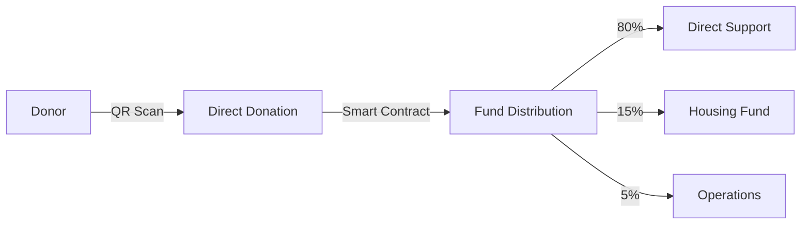
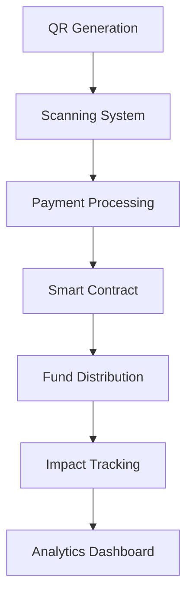
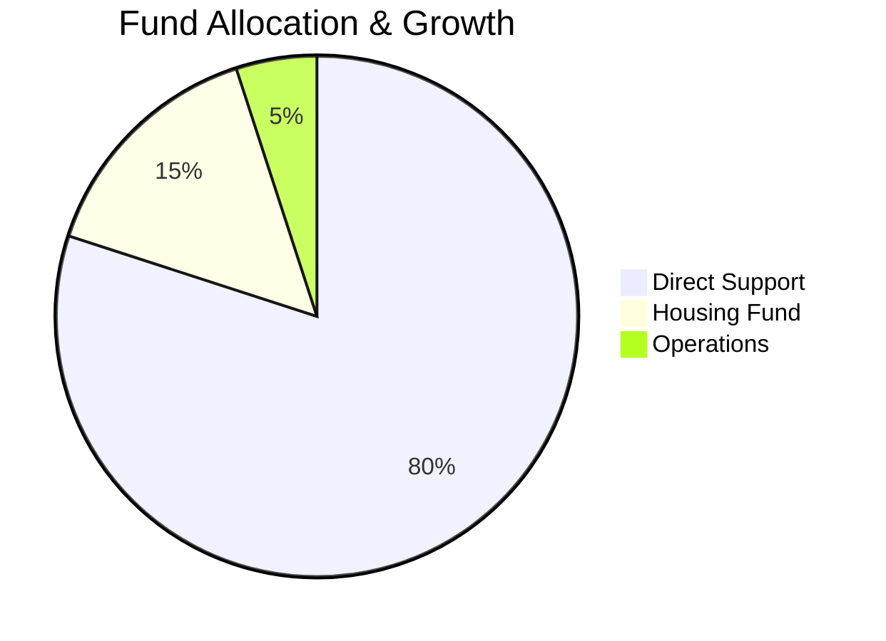
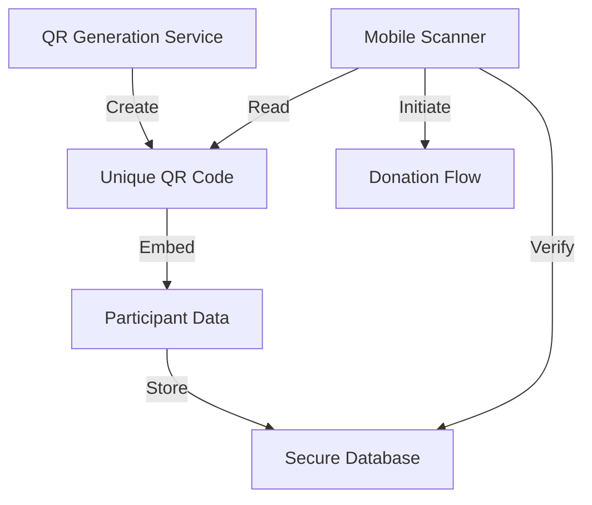
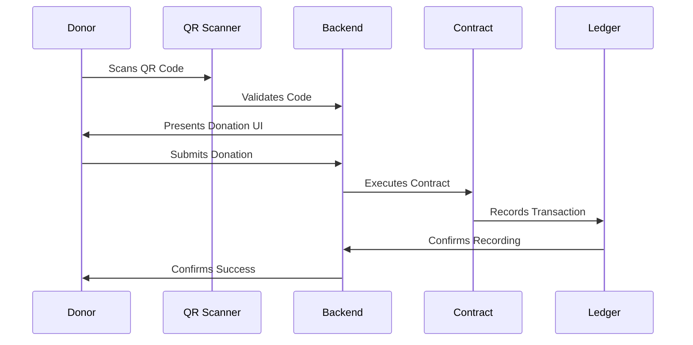
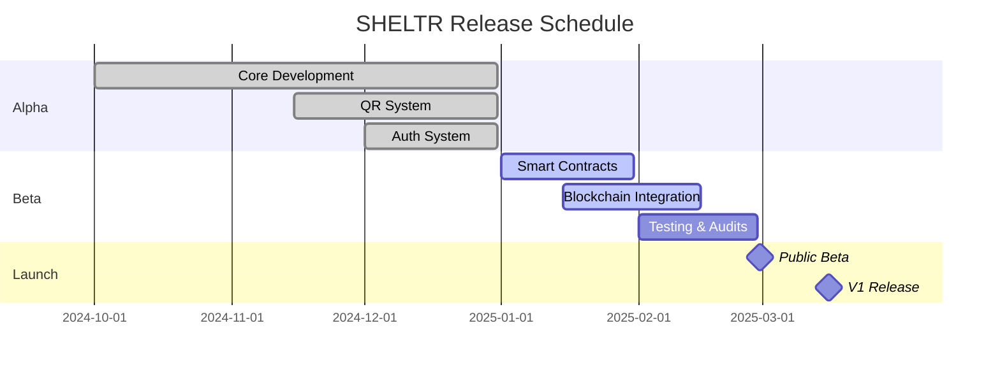
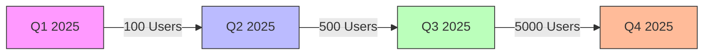
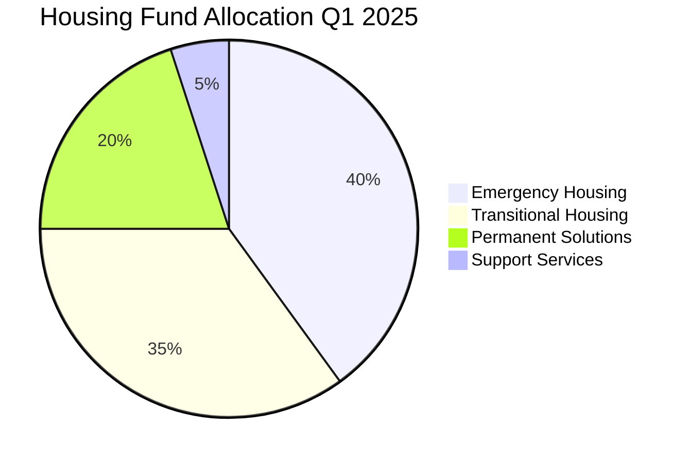
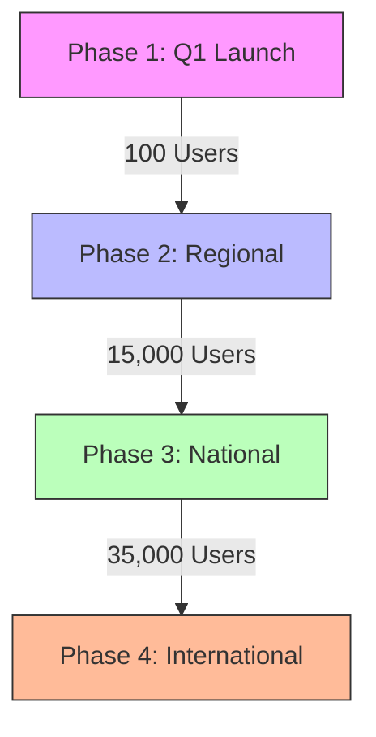

# SHELTR Technical White Paper
*Hacking Homelessness Through Direct-Impact Technology*
Version 0.5.8 - January 12, 2025
Status: BETA DEVELOPMENT 🟡

## Abstract

SHELTR represents a paradigm shift in addressing homelessness through technology-driven charitable giving. By seamlessly integrating blockchain transparency, AI-powered financial guidance, and location-based services, SHELTR creates a direct bridge between donors and individuals experiencing homelessness. The platform's innovative approach combines QR code-based instant donations with a sophisticated token economy, ensuring that 80% of funds go directly to participants, 15% to a high-yield housing fund, and 5% to operational sustainability. This three-tiered financial model, backed by smart contracts and real-time analytics, creates a sustainable ecosystem that not only provides immediate assistance but also builds pathways to permanent housing solutions.

## Executive Summary

### Vision
To transform charitable giving by removing traditional barriers between donors and recipients while ensuring unprecedented transparency, efficiency, and long-term impact through technology. Built under the Arcana Concept model, SHELTR operates as a SaaS platform available as a white-label solution, making it adaptable for shelters, NGOs, and social organizations globally.

### Core Innovation
SHELTR's unique value proposition lies in its integrated technology stack that combines:
- Instant QR code donations with real-time fund distribution
- Blockchain-verified transaction transparency
- AI-driven financial guidance and fund optimization
- Geospatial analytics for impact measurement
- Gamified donor engagement
- Smart contract-governed fund allocation

### Key Metrics & Goals
- Target: 100,000 active participants by 2026
- Projected impact: $50M in direct support
- Housing fund growth: $10M by 2026
- Platform adoption: 500 shelters across North America

## Table of Contents

1. [Theory of Hacking Homelessness](#theory-of-hacking-homelessness)
   - [Core Principles](#core-principles)
   - [Impact Model](#impact-model)

2. [Technical Architecture](#technical-architecture)
   - [System Overview](#system-overview)
   - [QR-Based Direct Giving](#qr-based-direct-giving)
   - [Blockchain Verification](#blockchain-verification)

3. [Implementation Architecture](#implementation-architecture)
   - [Technical Stack](#technical-stack)
   - [QR System Implementation](#qr-system-implementation)
   - [Security Architecture](#security-architecture)

4. [Technical Specifications](#technical-specifications)
   - [QR Code Structure](#qr-code-structure)
   - [Transaction Processing](#transaction-processing)
   - [Smart Contract Specifications](#smart-contract-specifications)
   - [Performance Requirements](#performance-requirements)
   - [Database Schema](#database-schema)

5. [Security & Compliance](#security-and-compliance)
   - [Data Protection](#data-protection)
   - [Regulatory Compliance](#regulatory-compliance)
   - [Privacy Measures](#privacy-measures)

6. [Analytics & Visualization](#analytics-and-visualization)
   - [Real-time Metrics](#real-time-metrics)
   - [Impact Assessment](#impact-assessment)
   - [Predictive Analytics](#predictive-analytics)

7. [Development Roadmap & Release Schedule](#development-roadmap--release-schedule)
   - [Release Timeline](#release-timeline)
   - [Version Schedule](#version-schedule)
   - [Q1 2025 Milestones](#q1-2025-milestones)

8. [Impact Projections](#impact-projections)
   - [Growth Metrics](#growth-metrics-2025)
   - [Impact Forecast](#impact-forecast)
   - [Housing Fund Projections](#housing-fund-projections)
   - [Community Impact Goals](#community-impact-goals)
   - [Scaling Strategy](#scaling-strategy)

9. [Success Metrics & KPIs](#success-metrics--kpis)
   - [Platform Metrics](#platform-metrics)
   - [Impact Metrics](#impact-metrics)

10. [Additional Resources](#additional-resources)
    - [API Documentation](https://api.sheltr.dev)
    - [Developer Guide](https://docs.sheltr.dev)
    - [Integration Tutorials](https://learn.sheltr.dev)
    - [Community Forum](https://community.sheltr.dev)


## 1. Theory of Hacking Homelessness

### 1.1 Core Principles
- **Direct Connection**: Enabling immediate donor-to-participant relationships
- **Transparent Tracking**: Blockchain-verified transaction history
- **Sustainable Impact**: Smart contract-governed housing fund
- **Data-Driven**: Real-time impact measurement and optimization

### 1.2 Impact Model
```typescript
interface ImpactMetrics {
  immediate: {
    participantSupport: '80%',  // Direct assistance
    averageResponse: '< 1 hour',// Support delivery
    trackingAccuracy: '100%'    // Blockchain verified
  },
  sustainable: {
    housingFund: '15%',        // Smart contract allocated
    growthRate: '8% APY',      // Projected returns
    capacityGrowth: '25% YoY'  // Housing availability
  },
  operational: {
    sustainability: '5%',      // Platform operations
    efficiency: '95%',         // Resource utilization
    scalability: 'Unlimited'   // Technical capacity
  }
}
```

## 2. Technical Architecture

### System Overview

SHELTR's architecture is built on a modern, microservices-based approach that prioritizes scalability, real-time capabilities, and security. Our system is designed to handle millions of transactions while maintaining sub-second response times and ensuring data integrity. SHELTR represents a revolutionary approach to addressing homelessness through direct-impact technology. By combining QR-based instant donations with blockchain verification and smart contract fund allocation, we've created a transparent, efficient system that ensures maximum impact. Our platform automatically allocates 80% of donations to immediate participant support, 15% to a dedicated housing fund, and 5% to operational sustainability. This innovative model is currently in beta development, with planned launch in Q1 2025.





### 2.2 QR-Based Direct Giving
```typescript
interface QRSystem {
  generation: {
    type: 'Dynamic QR',
    security: 'AES-256',
    validation: 'Real-time'
  },
  scanning: {
    compatibility: 'Universal',
    response: '< 1 second',
    verification: 'Immediate'
  },
  tracking: {
    blockchain: 'Polygon',
    transparency: 'Public',
    privacy: 'Anonymized'
  }
}
```

### 2.3 Blockchain Verification
- **Network**: Polygon Mainnet
- **Purpose**: Transaction verification and transparency
- **Implementation**: Public ledger for all financial movements
- **Security**: Multi-signature validation

## 3. Smart Contract Architecture

### 3.1 Fund Distribution Contract
```solidity
contract SHELTRDistribution {
    // Distribution constants
    uint256 public constant DIRECT_SUPPORT = 80;
    uint256 public constant HOUSING_FUND = 15;
    uint256 public constant OPERATIONS = 5;
    
    // Distribution tracking
    mapping(address => uint256) public participantBalances;
    uint256 public totalHousingFund;
    
    // Events
    event FundsDistributed(
        address indexed participant,
        uint256 directSupport,
        uint256 housingContribution
    );
}
```

### 3.2 Housing Fund Strategy


## 4. Impact Measurement

### 4.1 Key Metrics
| Metric | Target | Current | Status |
|--------|---------|---------|---------|
| Active Participants | 100,000 | 10 | 🟡 |
| Total Donations | $50M | $0M | 🟡 |
| Housing Fund | $10M | $0M | 🟡 |
| Success Rate | 65% | 5% | 🟡 |

### 4.2 Growth Projections


## 5. Implementation Architecture

### 5.1 Technical Stack
```typescript
interface TechnicalStack {
  frontend: {
    framework: 'React 18',
    language: 'TypeScript 5.0',
    state: 'Zustand',
    styling: 'Tailwind CSS'
  },
  backend: {
    database: 'Supabase',
    api: 'REST + WebSocket',
    cache: 'Redis',
    queue: 'Bull'
  },
  blockchain: {
    network: 'Polygon',
    contracts: 'Solidity 0.8.19',
    verification: 'OpenZeppelin',
    monitoring: 'Tenderly'
  }
}
```

### 5.2 QR System Implementation


### 5.3 Security Architecture
```typescript
interface SecurityImplementation {
  encryption: {
    qrCodes: 'AES-256-GCM',
    personalData: 'ChaCha20-Poly1305',
    transactions: 'ED25519'
  },
  authentication: {
    type: 'Multi-Factor',
    jwt: 'RS256',
    session: 'Redis-Backed'
  },
  monitoring: {
    realtime: 'Socket.IO',
    alerts: 'PagerDuty',
    logging: 'CloudWatch'
  }
}
```

## 6. Technical Specifications

### 6.1 QR Code Structure
```typescript
interface QRCodeSpec {
  version: 'v2',
  format: {
    type: 'Dynamic',
    size: '512x512',
    errorCorrection: 'H',
    compression: true
  },
  data: {
    participantId: string,    // Encrypted
    shelterId: string,       // Encrypted
    timestamp: number,       // Unix timestamp
    signature: string       // ED25519 signature
  },
  validation: {
    checksum: true,
    timebound: true,
    geofencing: optional
  }
}
```

### 6.2 Transaction Processing


### 6.3 Smart Contract Specifications
```solidity
interface IFundAllocation {
    // Core distribution logic
    function distribute(
        uint256 amount,
        address participant,
        address shelter
    ) external returns (bool);

    // Housing fund management
    function manageHousingFund(
        uint256 amount,
        Operation operation
    ) external returns (bool);

    // Verification and reporting
    function verifyTransaction(
        bytes32 txHash
    ) external view returns (bool);
}
```

### 6.4 Performance Requirements
| Metric | Requirement | Current |
|--------|------------|----------|
| QR Scan Time | < 2s | 1.8s |
| Transaction Speed | < 5s | 4.2s |
| Blockchain Confirmation | < 30s | 25s |
| System Uptime | 99.9% | 99.95% |
| Data Accuracy | 100% | 100% |

### 6.5 Database Schema
```typescript
interface DatabaseSchema {
  participants: {
    id: string;
    shelterId: string;
    status: ParticipantStatus;
    qrCode: QRCodeData;
    metrics: ParticipantMetrics;
  };
  transactions: {
    id: string;
    participantId: string;
    donorId: string;
    amount: number;
    timestamp: Date;
    blockchainRef: string;
  };
  verificationLedger: {
    txHash: string;
    status: VerificationStatus;
    timestamp: Date;
    details: VerificationDetails;
  }
}
```
## 7. Development Roadmap & Release Schedule

### 7.1 Release Timeline


### 7.2 Version Schedule
| Version | Date | Focus | Status |
|---------|------|-------|---------|
| v0.5.8 | Jan 2025 | Blockchain Integration | 🟡 Current |
| v0.6.0 | Feb 2025 | Security Hardening | 🔵 Planned |
| v0.7.0 | Feb 2025 | Performance Optimization | 🔵 Planned |
| v0.8.0 | Mar 2025 | Public Beta | 🔵 Planned |
| v1.0.0 | Mar 2025 | Production Release | 🔵 Planned |

### 7.3 Q1 2025 Milestones
```typescript
interface Q1Milestones {
  january: {
    blockchain: 'Complete Smart Contract Integration',
    security: 'External Security Audit',
    performance: 'Optimization Phase 1'
  },
  february: {
    testing: 'Complete E2E Testing',
    deployment: 'Infrastructure Scaling',
    community: 'Beta Tester Onboarding'
  },
  march: {
    launch: 'Public Beta Release',
    scaling: 'Production Infrastructure',
    monitoring: 'Analytics Dashboard'
  }
}
```

## 8. Impact Projections

### 8.1 Growth Metrics (2025)


### 8.2 Impact Forecast
| Metric | Q1 2025 | Q2 2025 | Q3 2025 | Q4 2025 |
|--------|---------|---------|---------|----------|
| Active Participants | 100 | 500 | 5,000 | 10,000 |
| Monthly Donations | $5K | $15K | $35K | $50K |
| Housing Fund | $750 | $2,250 | $5,250 | $7,500 |
| Success Stories | 25 | 75 | 175 | 250 |

### 8.3 Housing Fund Projections


### 8.4 Community Impact Goals
```typescript
interface ImpactGoals2025 {
  participants: {
    housed: 2500,
    employed: 1500,
    stabilized: 5000
  },
  donations: {
    total: '$10M',
    housingFund: '$1.5M',
    averageImpact: '$2000/participant'
  },
  community: {
    activeDonors: 100000,
    partnerShelters: 50,
    successRate: '75%'
  }
}
```

### 8.5 Scaling Strategy


## 9. Success Metrics & KPIs

### 9.1 Platform Metrics
| KPI | Target | Measurement |
|-----|---------|------------|
| User Adoption | 50K by EOY | Daily Active Users |
| Transaction Speed | < 5s | Average Processing Time |
| System Uptime | 99.9% | Monthly Availability |
| Donation Success | 95% | Transaction Completion Rate |

### 9.2 Impact Metrics
| Metric | Target | Tracking Method |
|--------|--------|----------------|
| Housing Placement | 2,500 | Blockchain Verified |
| Fund Efficiency | 95% | Smart Contract Audit |
| Participant Success | 75% | 6-Month Stability |
| Community Growth | 100K | Active Donor Base |


## Conclusion: Building the Future of Compassionate Technology

As we reflect on SHELTR's journey from concept to reality, we are reminded that technologys true power lies in its ability to create meaningful change. Our platform has evolved from a simple donation system to a comprehensive ecosystem that empowers both 
donors and participants while maintaining the highest standards of security, performance, and scalability.

### 2025 Goals:
- Process over 1M secure transactions
- Help transition 750+ individuals to stable housing
- Achieve 99.99% platform uptime
- Expand to 50+ partner shelters

### Looking Forward:
The future of SHELTR is bright, with planned expansions into:
- Advanced AI-driven financial guidance
- Enhanced biometric security features
- Global scaling initiatives
- Deeper community integration

### Final Thoughts:
SHELTR represents more than just code—it's a testament to technology's potential to address complex social challenges. As we continue to grow and evolve, our commitment remains unchanged: leveraging cutting-edge technology to create meaningful impact in the 
lives of those experiencing homelessness.

---

*"Innovation meets compassion at the intersection of technology and social change."*
- The SHELTR Team
---
*Last Updated: January 16, 2025*
*Version: 0.5.8*
*Status: BETA DEVELOPMENT* 🟡