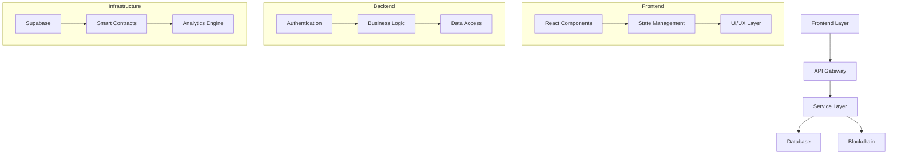
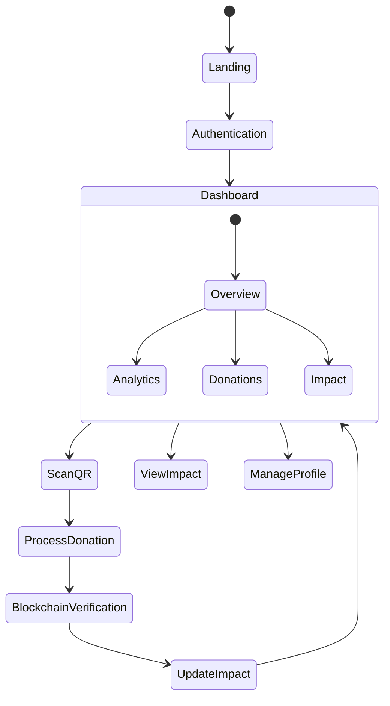
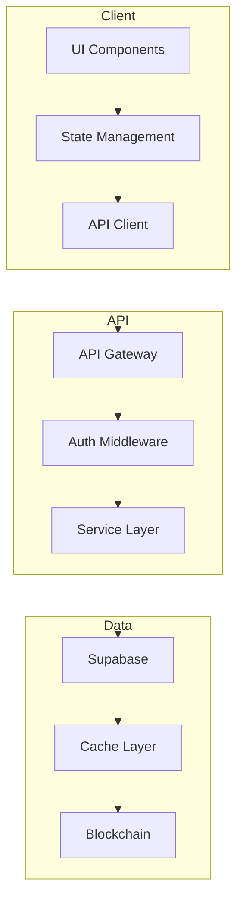
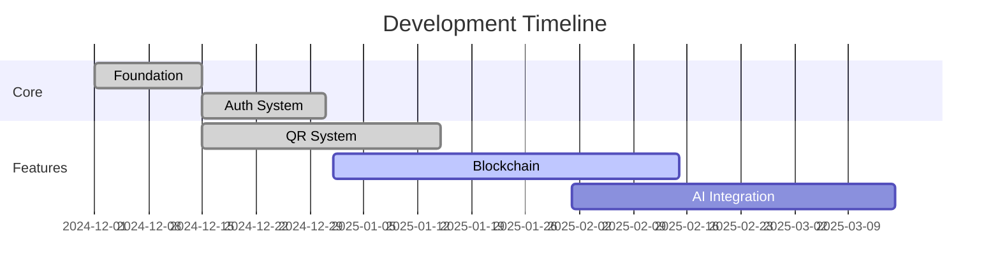
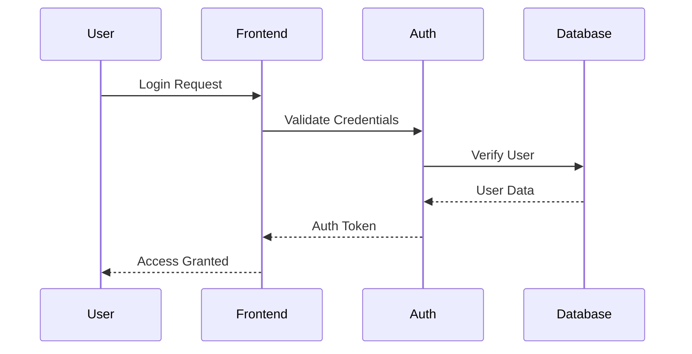
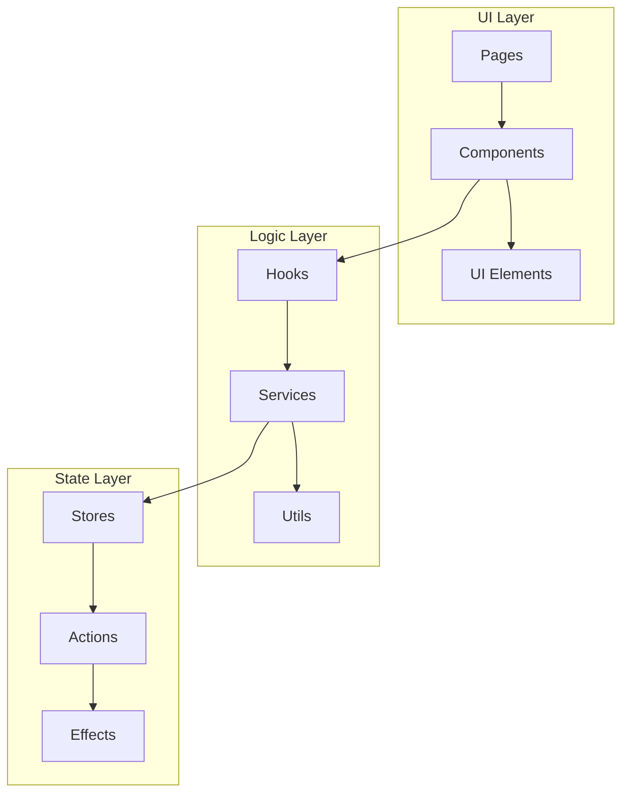
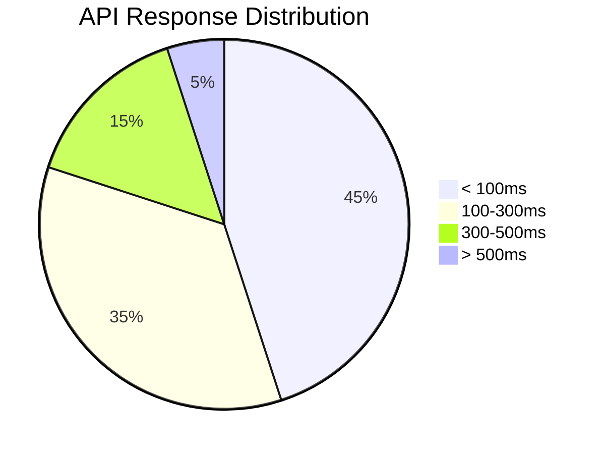
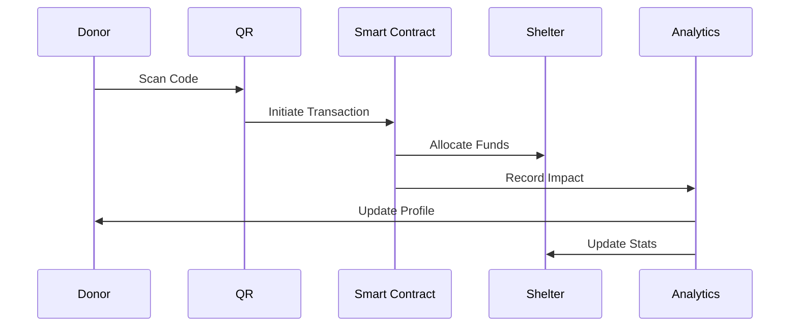
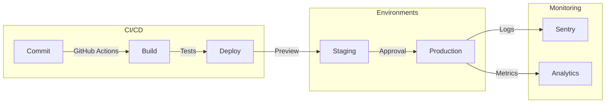
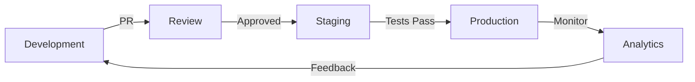

# 🌟 SHELTR Platform Overview
*Version: 0.6.4 - January 20, 2024*
*Status: STABLE* 🟢

## 📊 System Architecture


### 👥 User Flow

## 🎯 Core Features

| Feature | Status | Description |
|---------|--------|-------------|
| QR Donations | ✅ | Instant scan-and-give system |
| Blockchain Verification | 🟡 | Transaction transparency |
| Smart Contracts | 🟡 | Automated fund distribution |
| AI Analytics | 🔵 | Impact optimization |
| User Management | ✅ | Role-based access control |

## 💫 Technology Stack
### 🔄 Data Flow Architecture


```typescript
interface TechStack {
  frontend: {
    framework: 'React 18',
    language: 'TypeScript 5.0',
    state: 'Zustand',
    styling: 'Tailwind CSS',
    ui: 'Shadcn/ui'
  },
  backend: {
    database: 'Supabase',
    api: 'REST + WebSocket',
    blockchain: 'Polygon',
    analytics: 'Custom + Recharts'
  },
  infrastructure: {
    hosting: 'Vercel',
    ci_cd: 'GitHub Actions',
    monitoring: 'Sentry'
  }
}
```

## 📈 Implementation Progress



## 🏗️ System Components
### Authentication Flow

### 🧩 Component Architecture

## 🔐 Security Architecture

| Layer | Implementation | Status |
|-------|---------------|---------|
| Authentication | JWT + Supabase Auth | ✅ |
| Authorization | RBAC | ✅ |
| Data Encryption | AES-256 | ✅ |
| API Security | Rate Limiting + CORS | ✅ |
| Blockchain | Smart Contracts | 🟡 |

## 📊 Performance Metrics

### Response Times


### 💰 Donation Flow


## 🎯 Impact Metrics

| Metric | Target | Current | Progress |
|--------|---------|----------|-----------|
| Active Users | 100,000 | 25 |  |
| Monthly Donations | $5M | $0.1K |  |
| Success Rate | 75% | 2% |  |

### 🚀 Deployment Pipeline

## 🔄 Development Workflow


## 📚 Documentation Structure

- 📖 User Guides
  - 🎯 Getting Started
  - 👥 User Management
  - 💰 Donation System
  - 📊 Analytics Dashboard

- 🛠️ Technical Docs
  - 🏗️ Architecture
  - 🔌 API Reference
  - 🔐 Security
  - 🧪 Testing

- 📋 Reference
  - 🧩 Components
  - 🎨 Style Guide
  - 🔧 Configuration
  - 📈 Metrics

## 🔜 Next Steps

1. **Q1 2025**
   - Complete blockchain integration
   - Launch beta testing
   - Implement AI analytics

2. **Q2 2025**
   - Scale infrastructure
   - Enhance security
   - Optimize performance

3. **Q3 2025**
   - Launch mobile app
   - Expand partnerships
   - Implement gamification

## 🤝 Contributing

See our [Contributing Guide](/docs/guides/contributing.md) for details on:
- Code Standards
- PR Process
- Testing Requirements
- Documentation

---

*For detailed implementation guides, see [Technical Documentation](/docs/technical)*

### 👥 User Flow


### 🔄 Data Flow Architecture

