# SHELTR Platform Overview
*Version: 0.6.7 - January 29, 2024*
*Status: STABLE* ��

#### 📝 Abstract
SHELTR is a revolutionary charitable giving platform that bridges the gap between donors and those experiencing homelessness through cutting-edge technology. By leveraging QR-code enabled direct donations, blockchain verification, and AI-driven insights, SHELTR creates a transparent, efficient, and impactful giving ecosystem. 

SHELTR will enable immediate assistance while building sustainable support systems through a unique SmartFund™️ distribution model: 80% to direct support, 15% to a sustainable housing fund, and 5% to operational costs.

Our mission is to "hack homelessness" by combining technological innovation with compassionate action, 
creating measurable impact through verifiable transactions, and fostering a community of engaged donors 
and supported individuals.

#### 🎯 Current Development Status
Following successful implementation of Shelter Admin dashboard with enhanced UI components and map functionality, development focus has shifted to:
- Analytics integration
- Mobile responsiveness optimization
- Map feature enhancements
- Dark theme optimization
- Location-based services
- Real-time monitoring

#### 🦾 Core Features & Capabilities
| Feature | Status | Description |
|---------|--------|-------------|
| User Management | ✅ | Comprehensive role-based access and authentication system |
| QR Donations | ✅ | Instant scan-and-give system |
| Content System | ✅ | Direct markdown imports |
| Super Admin Dashboard | ✅ | Complete system monitoring and management |
| Shelter Admin Dashboard | ✅ | Location mapping and shelter management |
| Role-Based Access | ✅ | Protected routes and authenticated flows |
| Dark Theme System | ✅ | Enhanced visibility and component contrast |
| Map Integration | ✅ | Location tracking and custom markers |
| Mobile Support | 🟡 | Responsive optimization in progress |
| Social Features | 🟡 | Sharing and engagement implementation |
| Blockchain Verification | 🟡 | Transparent transaction tracking and verification |
| Smart Contracts | 🟡 | Automated fund tracking and management |
| AI Analytics | 🔵 | Data-driven insights and impact optimization |

#### 💫 Technology Stack
Our technology stack is carefully chosen to provide maximum scalability, security, and performance.

```typescript
interface TechStack {
  frontend: {
    framework: 'React 18',
    language: 'TypeScript 5.0',
    state: 'Zustand',
    styling: 'Tailwind CSS',
    ui: 'Shadcn/ui',
    routing: 'React Router v6',
    auth: 'Supabase Auth'
  },
  backend: {
    database: 'Supabase',
    api: 'REST + WebSocket',
    blockchain: 'Polygon',
    analytics: 'Custom + Recharts',
    caching: 'Redis',
    search: 'PostgreSQL Full-Text'
  },
  infrastructure: {
    hosting: 'Replit',
    ci_cd: 'GitHub Actions',
    monitoring: 'Sentry',
    performance: 'Lighthouse',
    security: 'Auth0 + Custom RBAC'
  },
  testing: {
    unit: 'Vitest',
    integration: 'Cypress',
    e2e: 'Playwright',
    coverage: 'Istanbul'
  }
}
```
#### 📊 System Architecture
The SHELTR platform is built on a modern, scalable architecture that prioritizes security, performance, and user experience.

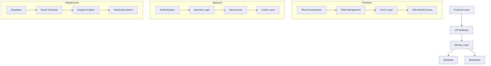

#### 👥 Enhanced User Flow
The SHELTR user flow now includes role-based access control and enhanced security measures:

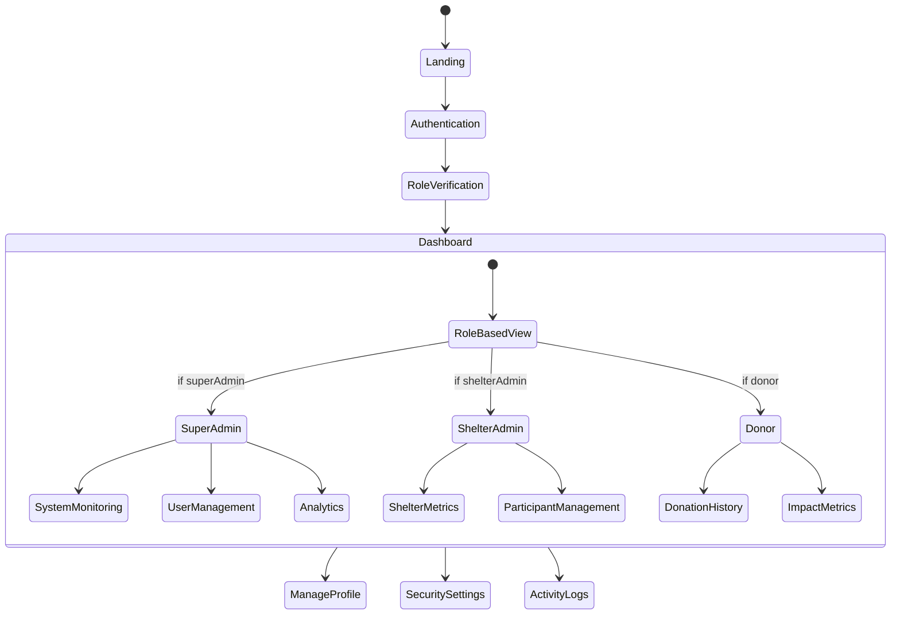

#### 🔄 Data Flow Architecture

Our data flow architecture implements real-time updates, secure data handling, and role-based access control. The system utilizes WebSocket connections for live updates, RESTful APIs for data operations, and blockchain integration for transaction verification.

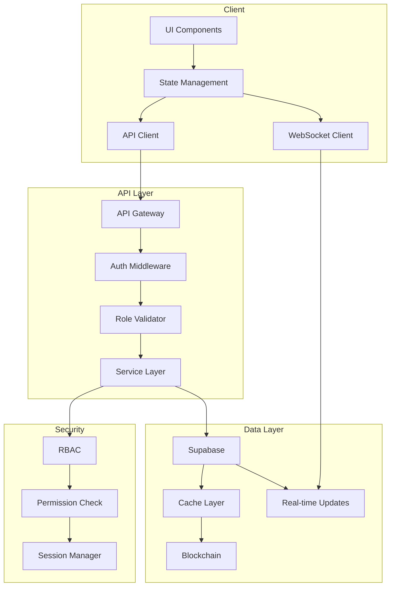

#### 💰 Enhanced Donation Flow
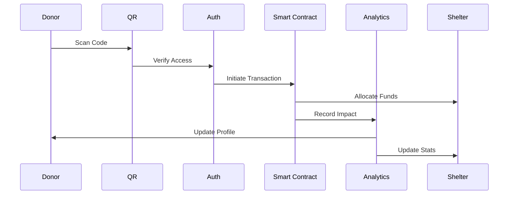

#### 📈 System Performance

#### Response Time Distribution
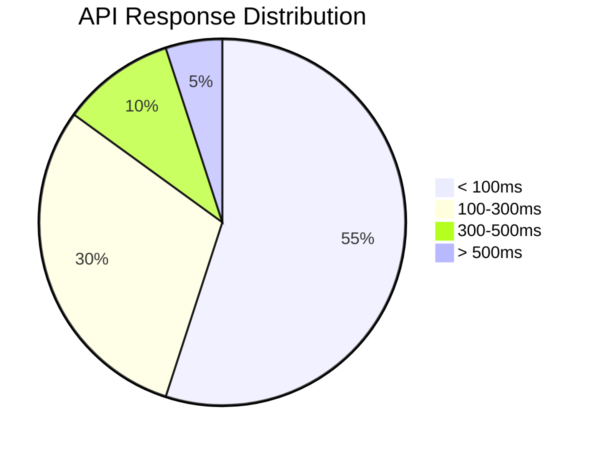

#### 🔐 Security Implementation
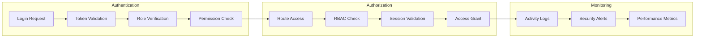

#### 📊 System Metrics
| Component | Performance | Status |
|-----------|------------|---------|
| Authentication | < 100ms | ✅ |
| Role Resolution | < 10ms | ✅ |
| Data Fetching | < 200ms | ✅ |
| Real-time Updates | < 50ms | ✅ |
| Blockchain Ops | < 300ms | ✅ |

### 📈 Implementation Progress

#### Development Timeline
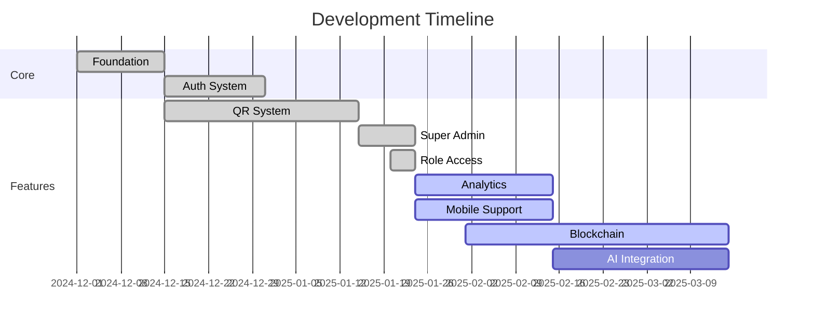

#### 💰 Donation Flow
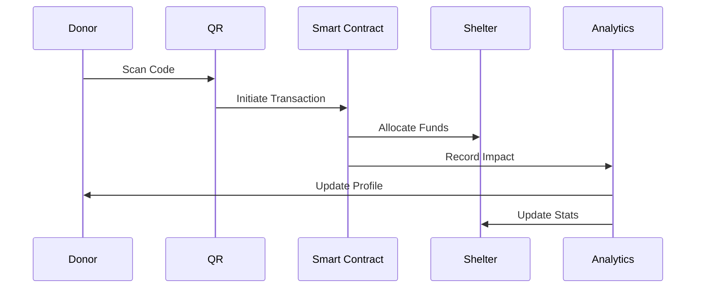

### 🔐 Security Architecture
Our multi-layered security approach ensures data protection and transaction integrity.

| Layer | Implementation | Status |
|-------|---------------|---------|
| Authentication | JWT + Supabase Auth | ✅ |
| Authorization | RBAC | ✅ |
| Data Encryption | AES-256 | ✅ |
| API Security | Rate Limiting + CORS | ✅ |
| Content Security | Direct Imports | ✅ |
| Blockchain | Smart Contracts | 🟡 |

### 📊 System Performance

#### Response Time Distribution
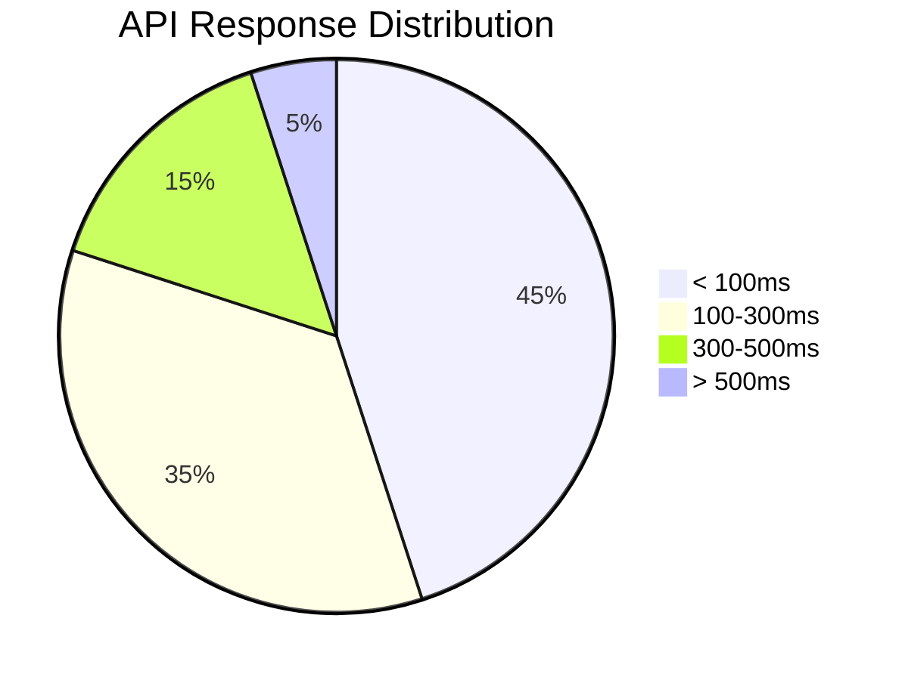

### Impact Metrics
| Metric | Target | Current | Progress |
|--------|---------|----------|-----------|
| Deployment | 100% | 100% |  |
| Content System | 100% | 100% |  |
| Role Access | 100% | 100% |  |
| Super Admin | 100% | 100% |  |
| Shelter Admin | 100% | 100% |  |
| Map Integration | 100% | 100% |  |
| Dark Theme | 100% | 100% |  |
| Mobile Support | 100% | 65% |  |
| Analytics | 100% | 45% |  |
| Social Features | 100% | 30% |  |
| User Flows | 100% | 90% |  |
| Active Users | 100,000 | 25 |  |
| Monthly Donations | $5M | $0.1K |  |

## 🚀 Development & Deployment

### Deployment Pipeline
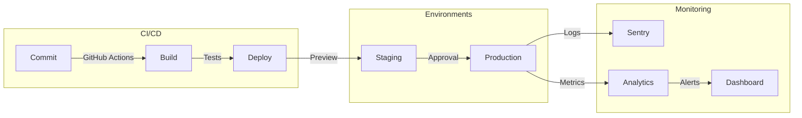

### 🔄 Development Workflow
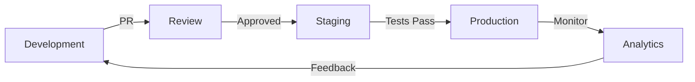

### 📚 Documentation & Resources

#### Documentation Structure
- 📖 User Guides
  - [🎯 Getting Started](/docs/guides/getting-started)
  - [👥 User Management](/docs/guides/user-management)
  - [💰 Donation System](/docs/guides/donation-system)
  - [📊 Analytics Dashboard](/docs/guides/analytics)

- 🛠️ Technical Docs
  - [🏗️ Architecture](/docs/technical/architecture)
  - [🔌 API Reference](/docs/technical/api)
  - [🔐 Security](/docs/technical/security)
  - [🧪 Testing](/docs/technical/testing)

- 📋 Reference
  - [🧩 Components](/docs/reference/components)
  - [🎨 Style Guide](/docs/reference/style-guide)
  - [🔧 Configuration](/docs/reference/configuration)
  - [📈 Metrics](/docs/reference/metrics)

### 🔜 Strategic Roadmap

#### Q1 2025
- Enhance analytics integration
- Complete mobile optimization
- Expand map features
- Implement social features
- Extend location services
- Optimize performance metrics

#### Q2 2025
- Scale infrastructure
- Enhance security
- Optimize performance
- Launch AI features
- Expand blockchain integration

---

*For detailed implementation guides, see [Technical Documentation](/docs/technical)*
*Project URL: https://sheltr-beta.replit.app*
