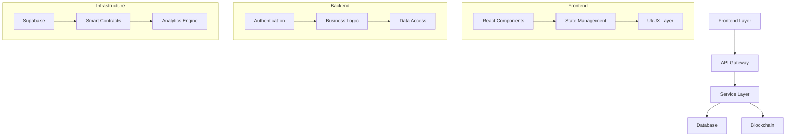
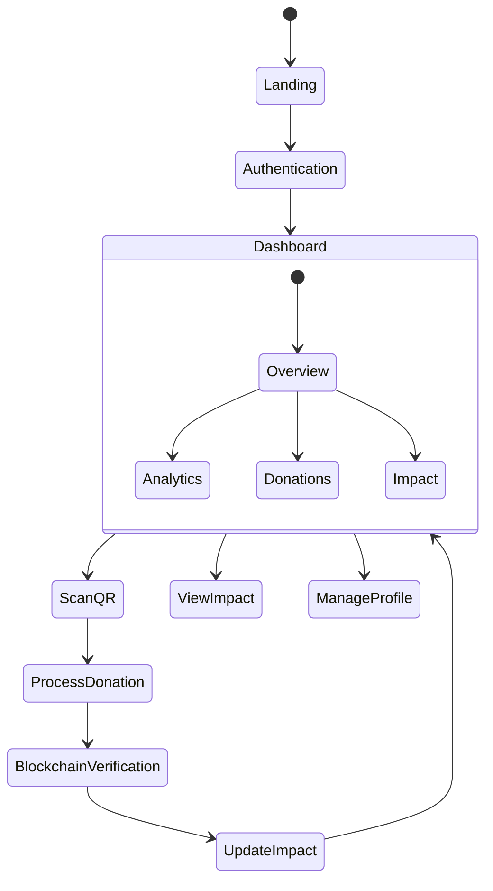
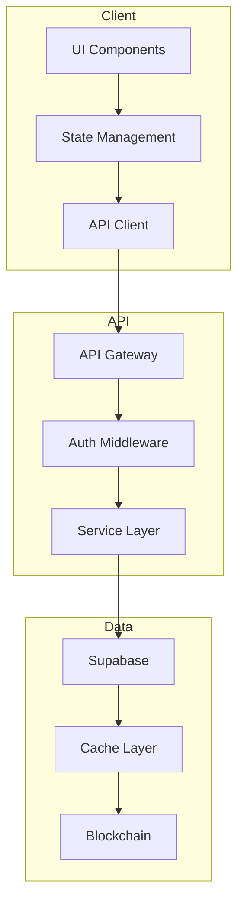
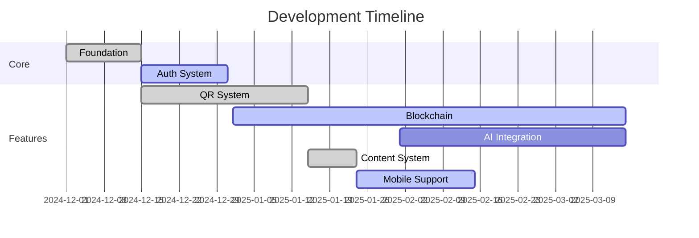
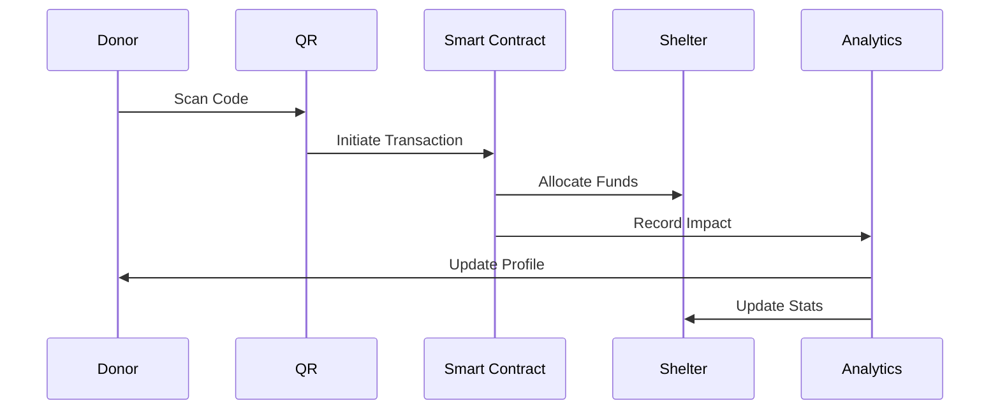
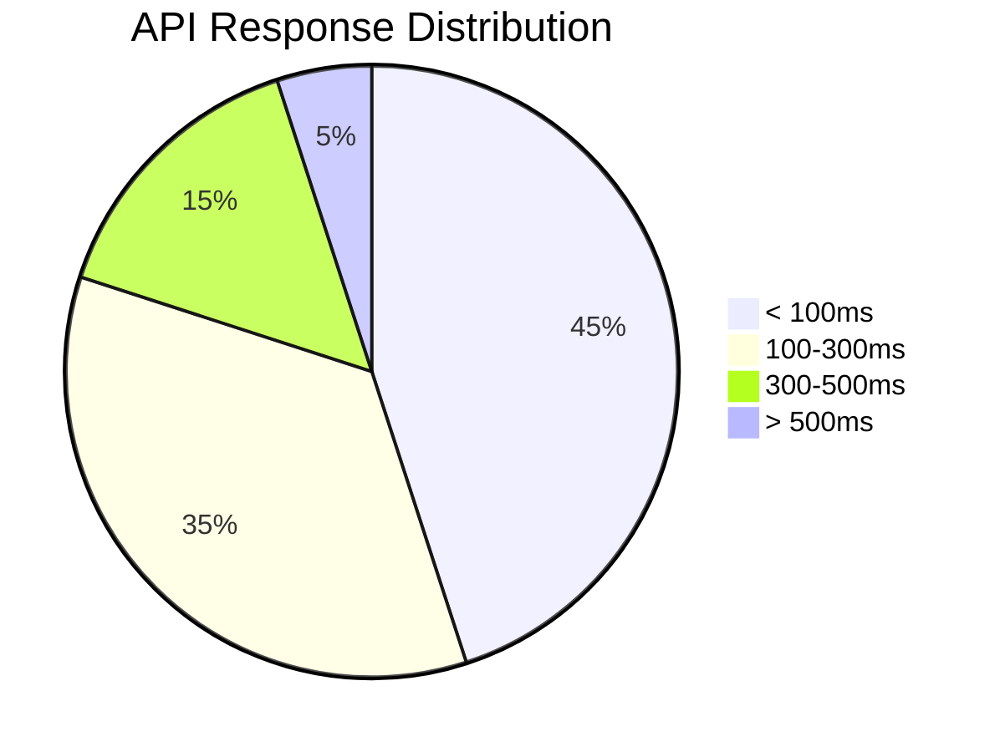
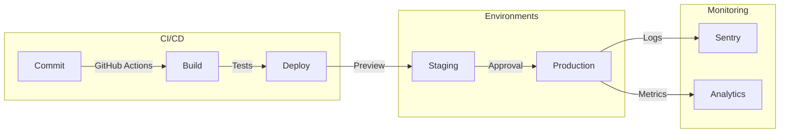
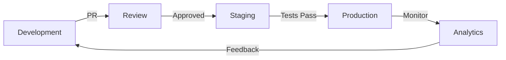

# 🌟 SHELTR Platform Overview
*Version: 0.6.5 - January 24, 2024*
*Status: STABLE* 🟢

## 📝 Abstract
SHELTR is a revolutionary charitable giving platform that bridges the gap between donors and those experiencing homelessness through cutting-edge technology. By leveraging QR-code enabled direct donations, blockchain verification, and AI-driven insights, SHELTR creates a transparent, efficient, and impactful giving ecosystem. The platform enables immediate assistance while building sustainable support systems through a unique 80/15/5 fund distribution model: 80% to direct support, 15% to a sustainable housing fund, and 5% to operational costs.

Our mission is to "hack homelessness" by combining technological innovation with compassionate action, 
creating measurable impact through verifiable transactions, and fostering a community of engaged donors 
and supported individuals.

## 🎯 Current Development Status
Following successful deployment stabilization and content system optimization, development focus has shifted to:
- Mobile responsiveness optimization
- Social integration features
- User authentication flows
- Role-specific dashboards
- Newsletter system implementation

## 🦾 Core Features & Capabilities
| Feature | Status | Description |
|---------|--------|-------------|
| User Management | ✅ | Comprehensive role-based access and authentication system |
| QR Donations | ✅ | Instant scan-and-give system |
| Content System | ✅ | Direct markdown imports |
| Mobile Support | 🟡 | Responsive optimization |
| Social Features | 🟡 | Sharing and engagement |
| Blockchain Verification | 🟡 | Transparent transaction tracking and verification
| Smart Contracts | 🟡 | Automated fund tracking and management through secure smart contracts |
| AI Analytics | 🔵 | Data-driven insights and impact optimization using artificial intelligence |

### 💫 Technology Stack
Our technology stack is carefully chosen to provide maximum scalability, security, and performance.

```typescript
interface TechStack {
  frontend: {
    framework: 'React 18',
    language: 'TypeScript 5.0',
    state: 'Zustand',
    styling: 'Tailwind CSS',
    ui: 'Shadcn/ui'
  },
  backend: {
    database: 'Supabase',
    api: 'REST + WebSocket',
    blockchain: 'Polygon',
    analytics: 'Custom + Recharts'
  },
  infrastructure: {
    hosting: 'Replit',
    ci_cd: 'GitHub Actions',
    monitoring: 'Sentry'
  }
}
```
## 📊 System Architecture
The SHELTR platform is built on a modern, scalable architecture that prioritizes security, performance, and user experience.



### 👥 User Flow

The SHELTR user flow is designed to be intuitive and efficient, guiding donors through a seamless donation process while ensuring transparency and trust. The flow encompasses user authentication, donation processing, impact tracking, and blockchain verification.



### 🔄 Data Flow Architecture

Our data flow architecture is built on modern web standards, implementing real-time updates and secure data handling. The system utilizes WebSocket connections for live updates, RESTful APIs for data operations, and blockchain integration for transaction verification and transparency.




## 📈 Implementation Progress

### Development Timeline


### 💰 Donation Flow


## 🔐 Security Architecture
Our multi-layered security approach ensures data protection and transaction integrity.

| Layer | Implementation | Status |
|-------|---------------|---------|
| Authentication | JWT + Supabase Auth | ✅ |
| Authorization | RBAC | ✅ |
| Data Encryption | AES-256 | ✅ |
| API Security | Rate Limiting + CORS | ✅ |
| Content Security | Direct Imports | ✅ |
| Blockchain | Smart Contracts | 🟡 |

## 📊 System Performance

### Response Time Distribution


### Impact Metrics
| Metric | Target | Current | Progress |
|--------|---------|----------|-----------|
| Deployment | 100% | 100% |  |
| Content System | 100% | 100% |  |
| Mobile Support | 100% | 60% |  |
| Social Features | 100% | 30% |  |
| User Flows | 100% | 45% |  |
| Active Users | 100,000 | 25 |  |
| Monthly Donations | $5M | $0.1K |  |
| Success Rate | 75% | 2% |  |

## 🚀 Development & Deployment

### Deployment Pipeline


### 🔄 Development Workflow


## 📚 Documentation & Resources

### Documentation Structure
- 📖 User Guides
  - [🎯 Getting Started](/docs/guides/getting-started)
  - [👥 User Management](/docs/guides/user-management)
  - [💰 Donation System](/docs/guides/donation-system)
  - [📊 Analytics Dashboard](/docs/guides/analytics)

- 🛠️ Technical Docs
  - [🏗️ Architecture](/docs/technical/architecture)
  - [🔌 API Reference](/docs/technical/api)
  - [🔐 Security](/docs/technical/security)
  - [🧪 Testing](/docs/technical/testing)

- 📋 Reference
  - [🧩 Components](/docs/reference/components)
  - [🎨 Style Guide](/docs/reference/style-guide)
  - [🔧 Configuration](/docs/reference/configuration)
  - [📈 Metrics](/docs/reference/metrics)

## 🔜 Strategic Roadmap

### Q1 2025
- Complete blockchain integration
- Launch beta testing program
- Implement AI analytics system

### Q2 2025
- Scale infrastructure
- Enhance security
- Optimize performance

---

*For detailed implementation guides, see [Technical Documentation](/docs/technical)*
*Project URL: https://sheltr-beta.replit.app*
