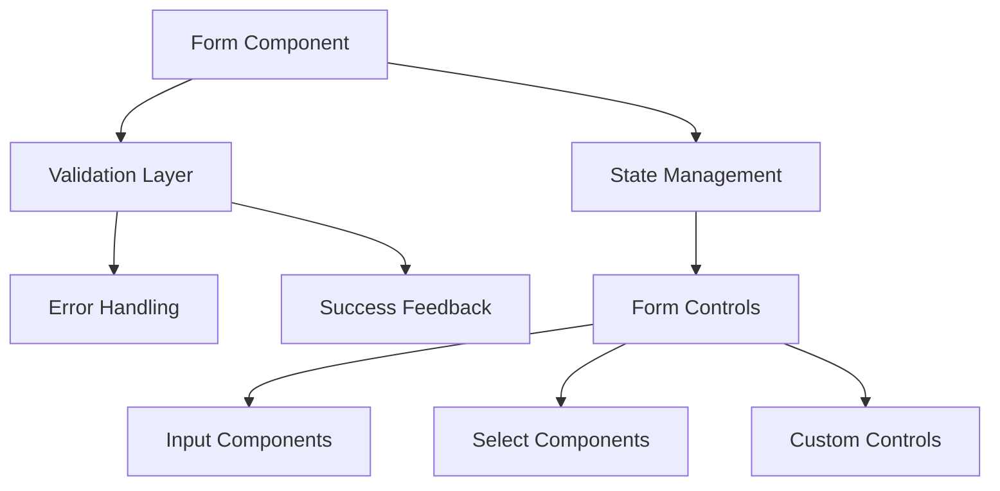
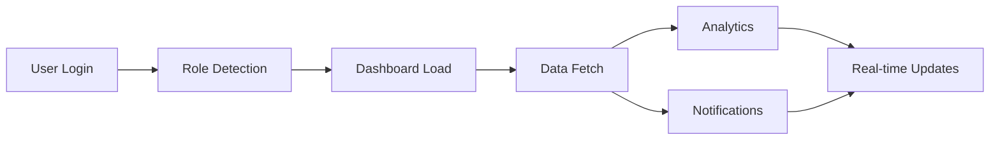

# 🚀 SHELTR Development Session - Architecture & Performance
*December 20, 2024 19:54 EST*
*Version: 0.4.8*

## 📝 Session Overview
We are in the process of architecture restructure and layout system optimization, we're now focusing on stabilizing page layouts and routes, user dashboard and analytics integration. Recent achievements include standardized component paths, enhanced routing configuration, and a 98/100 Lighthouse score. Current challenges involve form validation and login paths and protected routes.

## 🔄 Next Session Goals
1. **Visual Improvements**
   - Fix CTA background image
   - Adjust section spacing
   - Enhance gradient overlays
   - Optimize mobile layout

2. **Documentation Completion**
   - Finalize folder structure
   - Complete content migration
   - Update navigation links
   - Add search functionality

Would you like to focus on:
1. CTA section styling and background image
2. Documentation organization completion
3. Mobile responsiveness
4. Content migration strategy


## 📊 Current Status Matrix
| Area | Status | Progress | Priority |
|------|---------|----------|-----------|
| Layout System | 🟡 In Progress | 50% | 🔴 High |
| Component Paths | 🟡 In Progress | 50% | 🔴 High |
| Routing | 🟡 In Progress | 50% | 🔴 High |
| Performance | 🔄 In Progress | 75% | 🔴 High |
| Analytics | ⚠️ Pending | 20% | 🔴 High |

## 🎯 Implementation Focus
```typescript
interface PerformanceImplementation {
  monitoring: {
    metrics: ['Load time', 'First paint', 'Bundle size'],
    tracking: ['Component renders', 'Route transitions'],
    analytics: ['User flows', 'Error rates', 'Usage patterns']
  },
  optimization: {
    lazy: 'Component lazy loading',
    caching: 'Strategic data caching',
    prefetch: 'Route prefetching',
    bundling: 'Code splitting strategy'
  }
}
```

## 🔄 Session Goals
1. **Performance Monitoring Setup**
   - Implement metric tracking
   - Configure analytics
   - Set up error monitoring
   - Establish baselines

2. **Real-Time Updates**
   - Configure WebSocket connections
   - Implement data synchronization
   - Set up notification system
   - Optimize state updates

Would you like to focus on:
1. Performance monitoring implementation
2. Analytics integration
3. Real-time update system
4. Error tracking setup

*Previous Session: [December 20 - Architecture Restructure]*
*Project URL: https://sheltr-ops.replit.app/*
*Repository: https://github.com/mrj0nesmtl/sheltr-v2*# 🚨️ SHELTR Development Session - Form System & Validation
*December 20, 2024 19:54 EST*
*Version: 0.4.8*

## 📝 Session Overview
With our architecture restructure complete, we're focusing on building a robust form system with comprehensive validation. Our recent layout and routing optimizations provide a solid foundation for implementing user feedback and form state management. Key challenges include real-time validation and success notifications.

## 🎯 Form System Architecture


## 📊 Implementation Status
| Component | Status | Priority | Dependencies |
|-----------|---------|-----------|--------------|
| Form Base | 🟡 In Progress | 🔴 High | Layout System |
| Validation | ⚠️ Pending | 🔴 High | Form Base |
| Error Display | ⚠️ Pending | 🔴 High | Validation |
| Success States | ⚠️ Pending | 🟡 Medium | Validation |
| Input Fields | 🟡 In Progress | 🔴 High | Form Base |

## 🛠️ Implementation Plan
```typescript
interface FormSystem {
  components: {
    base: 'FormProvider with context',
    fields: ['Input', 'Select', 'Checkbox', 'Radio'],
    feedback: ['ErrorMessage', 'SuccessMessage', 'LoadingState'],
    validation: ['Rules', 'Schema', 'ErrorHandling']
  },
  features: {
    realtime: 'On-change validation',
    submission: 'Async form handling',
    feedback: 'User notification system',
    state: 'Form state management'
  }
}
```

## 🎯 Session Objectives
1. **Form Component System**
   - Base form provider
   - Field components
   - Validation integration
   - Error handling

2. **Validation Implementation**
   - Schema definition
   - Real-time validation
   - Error messages
   - Success states

Would you like to focus on:
1. Form component architecture
2. Validation system
3. Error handling
4. Success notifications

*Previous Session: [December 20 - Architecture Restructure]*
*Next Focus: Dashboard Analytics Integration*# 📊 SHELTR Development Session - Dashboard & Analytics
*December 20, 2024 19:54 EST*
*Version: 0.4.8*

## 📝 Session Overview
Building upon our successful architecture restructure, we're enhancing the dashboard with analytics integration and real-time updates. Recent achievements in layout optimization and component standardization set the stage for advanced dashboard features. Current focus: real-time data visualization and user analytics.

## 🔄 Dashboard Flow


## 📈 Analytics Implementation
```typescript
interface AnalyticsSystem {
  metrics: {
    donor: ['Donation frequency', 'Impact metrics', 'Usage patterns'],
    shelter: ['Resource allocation', 'Service usage', 'Participant data'],
    platform: ['User engagement', 'System performance', 'Error rates']
  },
  visualization: {
    charts: ['Line', 'Bar', 'Pie', 'Heat maps'],
    updates: 'Real-time data streaming',
    interaction: 'Interactive filters'
  },
  reporting: {
    automated: 'Scheduled reports',
    custom: 'User-defined metrics',
    export: 'Data download options'
  }
}
```

## 🎯 Implementation Matrix
| Feature | Status | Timeline | Priority |
|---------|---------|-----------|-----------|
| Basic Charts | 🟡 In Progress | 2 days | 🔴 High |
| Real-time Data | ⚠️ Pending | 3 days | 🔴 High |
| User Analytics | ⚠️ Pending | 2 days | 🟡 Medium |
| Export Tools | ⚠️ Pending | 2 days | 🟢 Low |

## 🛠️ Session Goals
1. **Analytics Integration**
   - Chart components
   - Data fetching
   - Real-time updates
   - User tracking

2. **Dashboard Enhancement**
   - Role-specific views
   - Interactive filters
   - Export functionality
   - Performance optimization

Would you like to focus on:
1. Analytics implementation
2. Dashboard enhancement
3. Real-time updates
4. Data visualization

*Previous Session: [December 20 - Form System Implementation]*
*Next Phase: User Analytics & Reporting*