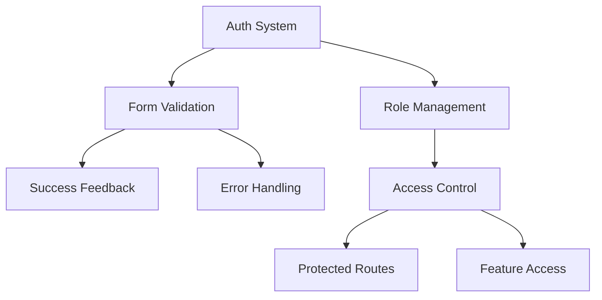

# 🚀 SHELTR Development Session - Form System & Authentication
*December 22, 2024 21:30 EST*
*Version: 0.4.9*

I'm working on SHELTR, an innovative platform revolutionizing charitable giving for homelessness through QR code donations, blockchain transparency, and AI-driven insights. We've recently completed a major documentation restructure and core system updates (v0.4.9), bringing our project to 92% structural completion. Our immediate focus is on implementing the authentication system and form validation framework, which are critical components for user engagement and security.
The platform has made significant progress with optimized layouts, standardized component paths, and enhanced routing configurations. We've successfully implemented the base QR scanner functionality and established the foundation for our analytics dashboard. Currently, we're tackling the authentication flows and form validation system, with particular emphasis on real-time feedback and success notifications.
I'd like to focus on implementing these core features, ensuring they align with our best practices and maintain our high standards for code quality and user experience. Could you help guide me through the next phase of development, particularly focusing on [specific area of focus]?

## 📝 Session Overview
With our documentation restructure complete and core systems updated, we're now focusing on implementing the form validation system and authentication flows. Recent achievements include documentation migration, environment optimization, and component standardization. Key challenges include form validation, auth page implementation, and success notifications.

## 🎯 Recent Completions
- ✅ Documentation system restructured
- ✅ Core files updated and verified
- ✅ Migration scripts implemented
- ✅ Environment configurations optimized
- ✅ Archive system established
- ✅ Component paths standardized
- ✅ Layout system optimized

## 🔄 Form & Auth Architecture


## 📊 Implementation Matrix
| Component | Status | Priority | Dependencies |
|-----------|---------|-----------|--------------|
| Auth Pages | ⚠️ Pending | 🔴 High | Form System |
| Form Validation | 🟡 In Progress | 🔴 High | Component System |
| Success States | ⚠️ Pending | 🔴 High | Form Validation |
| Role Access | 🟡 In Progress | 🔴 High | Auth System |

## 🛠️ Development Path
### Current Sprint
1. Authentication System Implementation
   - Login page completion
   - Signup flow integration
   - Role-based access control
   - Protected routes setup

2. Form System Development
   - Validation framework
   - Real-time feedback
   - Success notifications
   - Error handling system

### Upcoming Work
1. QR Scanner Enhancement
   - Offline support
   - Multi-device compatibility
   - Performance optimization
   - Error recovery system

2. Analytics Dashboard
   - Real-time updates
   - Data visualization
   - Export functionality
   - Custom reporting

## 🎯 Next Session Goals
1. **Authentication**
   - Complete login form implementation
   - Set up signup flow validation
   - Implement password recovery
   - Add email verification

2. **Form System**
   - Build validation framework
   - Add success notifications
   - Implement loading states
   - Create error handling

3. **User Experience**
   - Add form feedback
   - Implement transitions
   - Create success animations
   - Enhance error messages

## 📊 Current Status Matrix
| Area | Status | Progress | Priority |
|------|---------|----------|-----------|
| Auth System | 🟡 In Progress | 60% | 🔴 High |
| Form Validation | 🟡 In Progress | 50% | 🔴 High |
| Success States | ⚠️ Pending | 20% | 🔴 High |
| Role Access | 🟡 In Progress | 70% | 🔴 High |

## 🎯 Implementation Focus
```typescript
interface AuthImplementation {
  validation: {
    forms: ['Login', 'Signup', 'Recovery'],
    feedback: ['Success', 'Error', 'Loading'],
    states: ['Valid', 'Invalid', 'Pending']
  },
  protection: {
    routes: 'Protected route system',
    roles: 'Role-based access control',
    features: 'Feature-based permissions'
  }
}
```

## 🔄 Would you like to focus on:
1. Auth page implementation
2. Form validation system
3. Success notifications
4. Role-based access
5. QR scanner enhancement
6. Analytics dashboard development

*Previous Session: [December 22 - Documentation Restructure]*
*Project URL: https://sheltr-ops.replit.app/*
*Repository: https://github.com/mrj0nesmtl/sheltr-v2*