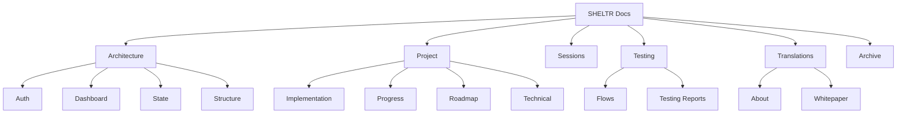

# 📚 SHELTR Documentation Map
*Last Updated: December 15, 2024*

## 🗺️ Documentation Structure



## 📑 Quick Reference

### 🏗️ Architecture
```bash
architecture/
├── auth/              # Authentication & Authorization
│   └── rbac.md       # Role-based access control
├── dashboard/         # Dashboard Architecture
│   └── architecture.md
├── state/            # State Management
│   └── dashboard.md
└── structure/        # Application Structure
    └── pages.md
```

### 📋 Project Management
```bash
project/
├── implementation/   # Implementation Details
│   ├── buildout_implementation.md
│   └── tech_stack.md
├── progress/        # Progress Tracking
│   ├── checkpoint.md
│   ├── dec15-restructure.md
│   └── status_report.md
├── roadmap/        # Project Roadmap
│   └── roadmap.md
└── technical/      # Technical Documentation
    ├── build_track.md
    └── changelog.md
```

### 👥 Sessions
```bash
sessions/           # Development Sessions
├── prompt.md      # Initial Session
├── prompt_2.md    # Detailed Planning
└── prompt_3.md    # Implementation Guide
```

### 🧪 Testing
```bash
testing/
├── flows/         # User Flow Testing
│   └── user_flows.md
└── user_flow_testing.md
```

### 🌐 Translations
```bash
translations/
├── about/         # About Documentation
│   ├── sheltr_intro_eng.md
│   └── sheltr_intro_fr.md
└── whitepaper/    # Whitepaper Translations
    ├── whitepaper_eng.md
    └── whitepaper_fr.md
```

## 📝 Document Types

### Technical Documents
- Architecture Specifications
- Implementation Guides
- State Management
- Testing Protocols

### Project Documents
- Progress Reports
- Roadmaps
- Status Updates
- Change Logs

### User Documentation
- Flow Diagrams
- User Guides
- Whitepapers
- Translations

## 🔄 Document Lifecycle

1. **Creation**
   - Initial Draft
   - Technical Review
   - Content Review

2. **Maintenance**
   - Regular Updates
   - Version Control
   - Change Tracking

3. **Archive**
   - Version History
   - Deprecated Docs
   - Reference Material

## 📈 Documentation Health

| Category | Status | Last Updated |
|----------|---------|--------------|
| Architecture | 🟢 Active | Dec 15, 2024 |
| Project | 🟡 In Progress | Dec 15, 2024 |
| Sessions | 🟢 Active | Dec 15, 2024 |
| Testing | 🟡 In Progress | Dec 15, 2024 |
| Translations | 🟢 Active | Dec 15, 2024 |

## 🎯 Documentation Goals

1. **Accessibility**
   - Clear Structure
   - Easy Navigation
   - Quick Reference

2. **Maintenance**
   - Regular Updates
   - Version Control
   - Change Tracking

3. **Quality**
   - Technical Accuracy
   - Completeness
   - Clarity

---

*Generated: December 15, 2024*
*Version: 1.0.0*