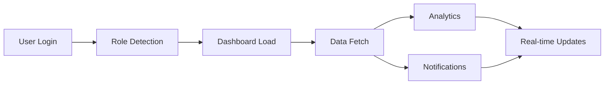

# 📊 SHELTR Development Session - Dashboard & Analytics
*December 20, 2024 19:54 EST*
*Version: 0.4.8*

## 📝 Session Overview
Building upon our successful architecture restructure, we're enhancing the dashboard with analytics integration and real-time updates. Recent achievements in layout optimization and component standardization set the stage for advanced dashboard features. Current focus: real-time data visualization and user analytics.

## 🔄 Dashboard Flow


## 📈 Analytics Implementation
```typescript
interface AnalyticsSystem {
  metrics: {
    donor: ['Donation frequency', 'Impact metrics', 'Usage patterns'],
    shelter: ['Resource allocation', 'Service usage', 'Participant data'],
    platform: ['User engagement', 'System performance', 'Error rates']
  },
  visualization: {
    charts: ['Line', 'Bar', 'Pie', 'Heat maps'],
    updates: 'Real-time data streaming',
    interaction: 'Interactive filters'
  },
  reporting: {
    automated: 'Scheduled reports',
    custom: 'User-defined metrics',
    export: 'Data download options'
  }
}
```

## 🎯 Implementation Matrix
| Feature | Status | Timeline | Priority |
|---------|---------|-----------|-----------|
| Basic Charts | 🟡 In Progress | 2 days | 🔴 High |
| Real-time Data | ⚠️ Pending | 3 days | 🔴 High |
| User Analytics | ⚠️ Pending | 2 days | 🟡 Medium |
| Export Tools | ⚠️ Pending | 2 days | 🟢 Low |

## 🛠️ Session Goals
1. **Analytics Integration**
   - Chart components
   - Data fetching
   - Real-time updates
   - User tracking

2. **Dashboard Enhancement**
   - Role-specific views
   - Interactive filters
   - Export functionality
   - Performance optimization

Would you like to focus on:
1. Analytics implementation
2. Dashboard enhancement
3. Real-time updates
4. Data visualization

*Previous Session: [December 20 - Form System Implementation]*
*Next Phase: User Analytics & Reporting*