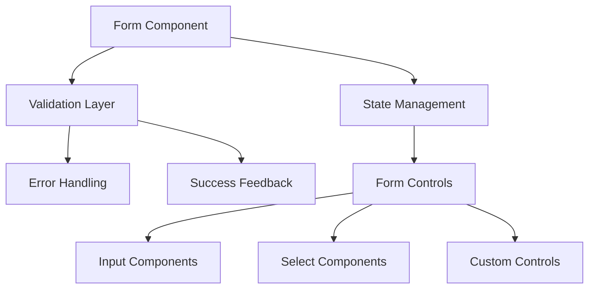

# 🚨️ SHELTR Development Session - Form System & Validation
*December 20, 2024 19:54 EST*
*Version: 0.4.8*

## 📝 Session Overview
With our architecture restructure complete, we're focusing on building a robust form system with comprehensive validation. Our recent layout and routing optimizations provide a solid foundation for implementing user feedback and form state management. Key challenges include real-time validation and success notifications.

## 🎯 Form System Architecture


## 📊 Implementation Status
| Component | Status | Priority | Dependencies |
|-----------|---------|-----------|--------------|
| Form Base | 🟡 In Progress | 🔴 High | Layout System |
| Validation | ⚠️ Pending | 🔴 High | Form Base |
| Error Display | ⚠️ Pending | 🔴 High | Validation |
| Success States | ⚠️ Pending | 🟡 Medium | Validation |
| Input Fields | 🟡 In Progress | 🔴 High | Form Base |

## 🛠️ Implementation Plan
```typescript
interface FormSystem {
  components: {
    base: 'FormProvider with context',
    fields: ['Input', 'Select', 'Checkbox', 'Radio'],
    feedback: ['ErrorMessage', 'SuccessMessage', 'LoadingState'],
    validation: ['Rules', 'Schema', 'ErrorHandling']
  },
  features: {
    realtime: 'On-change validation',
    submission: 'Async form handling',
    feedback: 'User notification system',
    state: 'Form state management'
  }
}
```

## 🎯 Session Objectives
1. **Form Component System**
   - Base form provider
   - Field components
   - Validation integration
   - Error handling

2. **Validation Implementation**
   - Schema definition
   - Real-time validation
   - Error messages
   - Success states

Would you like to focus on:
1. Form component architecture
2. Validation system
3. Error handling
4. Success notifications

*Previous Session: [December 20 - Architecture Restructure]*
*Next Focus: Dashboard Analytics Integration*