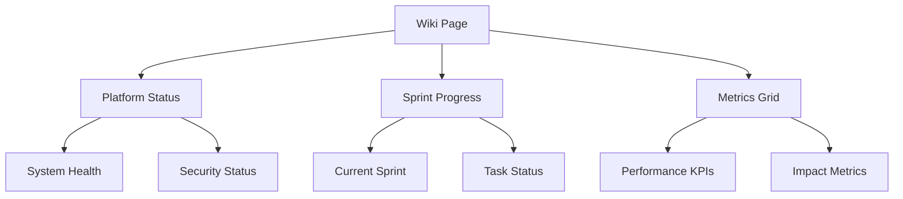

# SHELTR Wiki System Documentation

## Overview
The SHELTR Wiki system provides a comprehensive dashboard for monitoring platform status, tracking sprint progress, and visualizing key metrics.

## Architecture



## Components

### Platform Status Section
- Real-time system monitoring
- Security health tracking
- Response time metrics
- API status updates

### Sprint Progress
- Current sprint overview
- Task completion tracking
- Progress visualization
- Status indicators

### Metrics Grid
- Key performance indicators
- Impact measurements
- Donation tracking
- User engagement metrics

## Implementation Guide

```typescript
// Example Wiki implementation
import { Wiki } from '@/pages/Wiki';

const WikiPage = () => {
  return (
    <Wiki 
      features={{
        platformStatus: true,
        sprintProgress: true,
        metricsGrid: true
      }}
    />
  );
};
```

## Best Practices
1. Keep data fetching centralized
2. Implement error boundaries
3. Use TypeScript for type safety
4. Follow responsive design patterns
5. Maintain consistent styling

## Future Enhancements
- [ ] Real-time WebSocket updates
- [ ] Enhanced analytics
- [ ] Custom metric tracking
- [ ] User-specific views
- [ ] Extended documentation 